# Setting up KMS Server for vCenter

This guide shows you how to:

1. **Generate a Certificate Authority (CA)**
2. **Generate a server private key and CSR**
3. **Sign the server certificate with your CA**
4. **Verify the signed certificate**
5. **Export the certificate bundle to PKCS#12**
6. **Configure the KMS server (`kms.toml`)**

You'll use these certificates to connect your KMS instance to a vCenter environment.

---

## Prerequisites

- OpenSSL (≥ 1.1.1) installed and on your PATH
- A working copy of `openssl.cnf` with a `[ v3_ca ]` section
- UNIX shell (bash, zsh, etc.)
- A directory to store your certificates, e.g., `/etc/ssl/{{ORG_NAME}}_certs`

---

## 1. Generate Your CA

Create a 2048-bit RSA private key for your CA, then issue a self-signed root certificate:

```bash
# 1. Generate CA private key
openssl genrsa -out ca.key 2048

# 2. Create self-signed CA certificate (10 year validity)
openssl req -x509 -nodes -days 3650 \
  -new -key ca.key \
  -out ca.crt \
  -config openssl.cnf \
  -extensions v3_ca \
  -subj "/C=<COUNTRY>/ST=<STATE>/L=<CITY>/O=<ORG_NAME>/OU=<UNIT>/CN=<CA_COMMON_NAME>"
```

- **`ca.key`**: CA private key (keep this highly secure!)
- **`ca.crt`**: Public root certificate, used to sign and verify downstream certificates

---

## 2. Generate Server Key & CSR

Create a new 2048-bit RSA key for your KMS server and a CSR including EKU extensions:

```bash
openssl req -newkey rsa:2048 -nodes \
  -keyout server.key \
  -out server.csr \
  -subj "/CN=<SERVER_COMMON_NAME>/O=<ORG_NAME>/C=<COUNTRY>" \
  -addext "keyUsage = digitalSignature, keyEncipherment" \
  -addext "extendedKeyUsage = clientAuth, serverAuth"
```

- **`server.key`**: Server's private key
- **`server.csr`**: Certificate Signing Request, with `clientAuth` & `serverAuth` EKUs

---

## 3. Sign the Server Certificate

Use your CA to sign the CSR, embedding the same EKU settings in the issued certificate:

```bash
openssl x509 -req \
  -in server.csr \
  -CA ca.crt -CAkey ca.key -CAcreateserial \
  -out server.crt \
  -days 365 \
  -extfile <(printf "[req_ext]\n\
keyUsage = digitalSignature,keyEncipherment\n\
extendedKeyUsage = clientAuth,serverAuth\n") \
  -extensions req_ext
```

- **`server.crt`**: The signed certificate, valid for 1 year

---

## 4. Verify the Certificate Extensions

Confirm that your certificate contains the correct EKU fields:

```bash
openssl x509 -in server.crt -text -noout | grep -A1 "Extended Key Usage"
```

Expected output:

```sh
            X509v3 Extended Key Usage:
                TLS Web Server Authentication, TLS Web Client Authentication
```

---

## 5. Export to PKCS#12

Bundle your server certificate, private key, and CA chain into a single `.p12` archive:

```bash
openssl pkcs12 -export \
  -in server.crt \
  -inkey server.key \
  -certfile ca.crt \
  -out server.p12 \
  -name "{{SERVER_ALIAS}}" \
  -passout pass:<P12_PASSWORD>
```

- **`server.p12`**: PKCS#12 archive containing your key and certificates
- **`<P12_PASSWORD>`**: Password to unlock the archive — use a strong secret!

---

## 6. Configure the KMS Server (`kms.toml`)

Below is a template `kms.toml`. Update file paths, usernames, and passwords as required:

```toml
# General Configuration
default_username = "<USERNAME>"
force_default_username = false
socket_server_start = true

[http]
port = 9998
hostname = "0.0.0.0"
https_p12_file = "/etc/ssl/{{ORG_NAME}}_certs/server.p12"
https_p12_password = "<P12_PASSWORD>"
authority_cert_file = "/etc/ssl/{{ORG_NAME}}_certs/ca.crt"
```

Start the KMS with:

```bash
systemctl start cosmian_kms
```

---

## vCenter Integration

### Step 1: Go on your vCenter UI and add a Key Provider

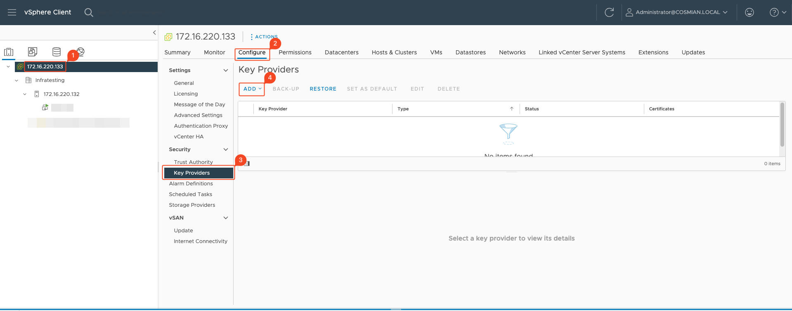

### Step 2: Add new Standard KMS Provider

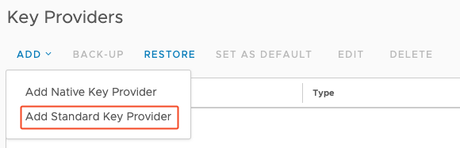

### Step 3: Set up your Standard Key Provider

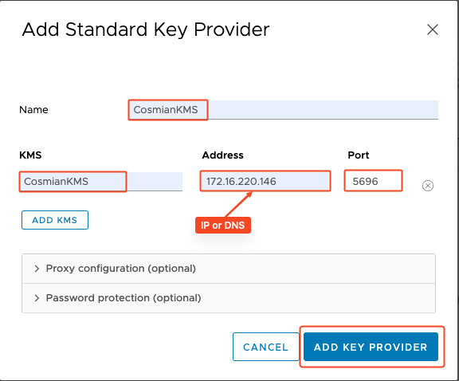

### Step 4: Trust the newly added Cosmian KMS

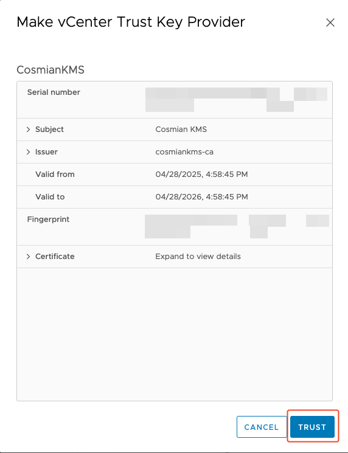

### Step 5: Establish Trust with the Cosmian KMS

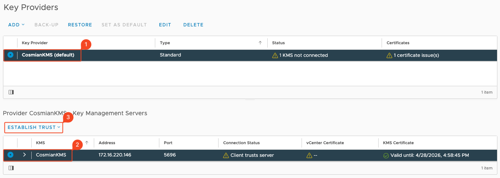

---

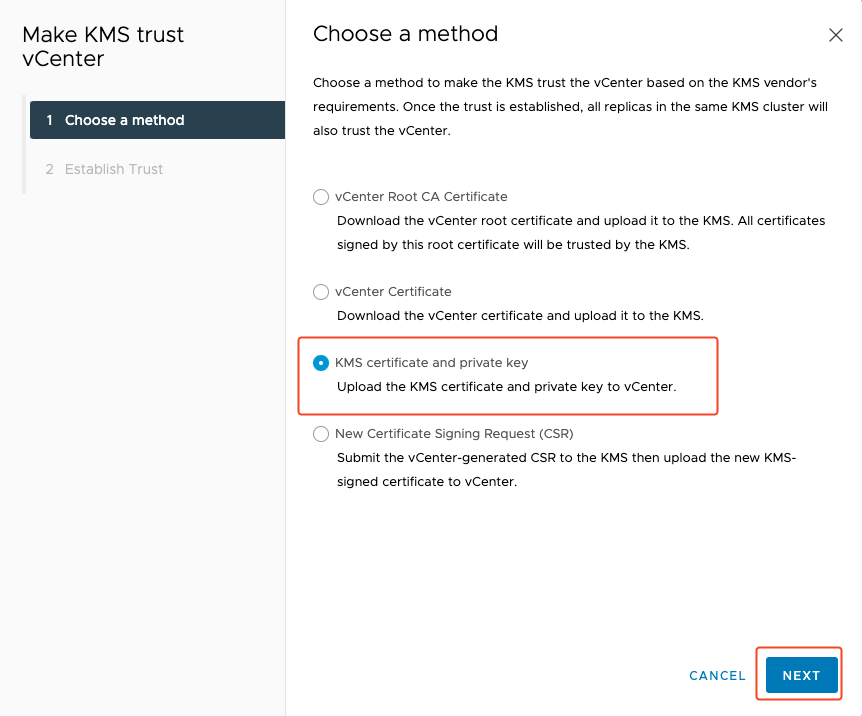

---
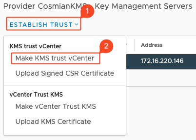

### Step 6: Go on the KMS server and get .crt and .key certificates

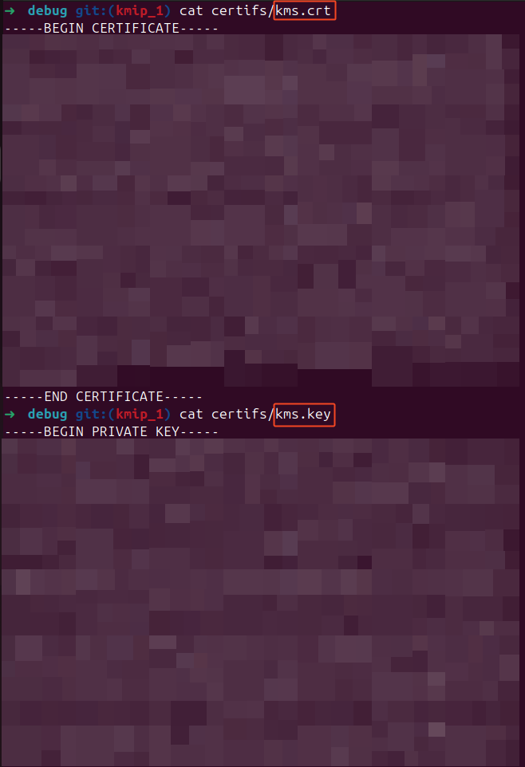

### Step 7: Upload KMS Credentials and establish trust

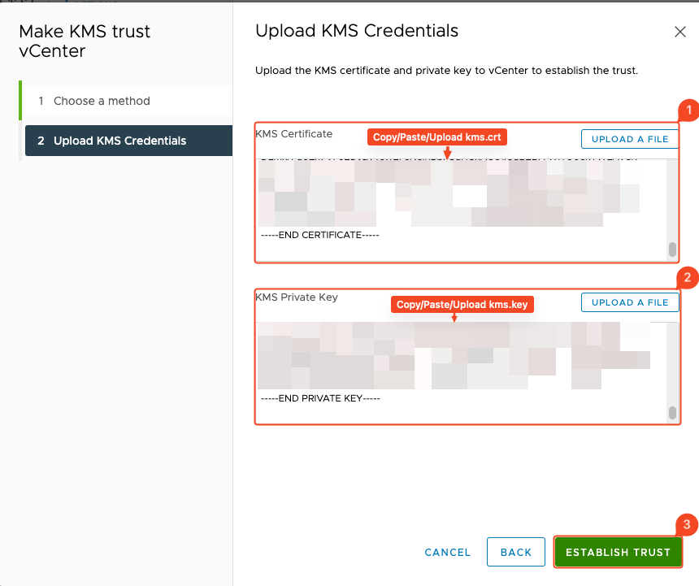

### Step 8: Your KMS is connected

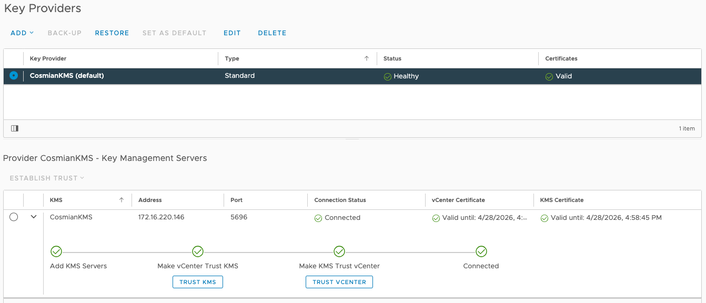

### Bonus: Encrypt your Virtual Machine

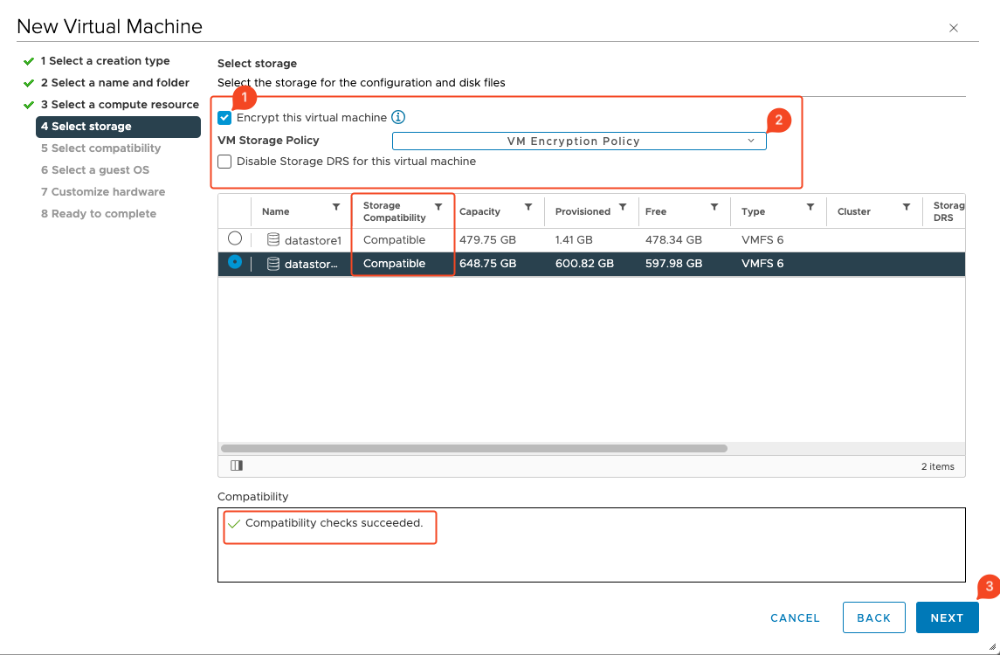

---

> _Keep all private keys secure and back up your CA key (`ca.key`) offline in an encrypted vault._
