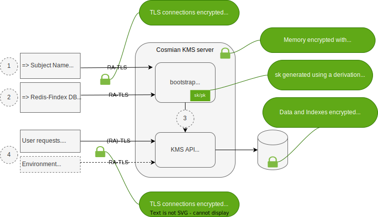

# Zero-trust KMS

The Cosmian KMS is designed to run in the cloud or any zero-trust environment.

The design provides:

- a secure mechanism to provide and keep encryption secrets on the servers
- runtime memory encryption
- verifiability of the correctness of the running environment



## Zero-trust design

The design relies on 3 features:

**Starting the server in bootstrap mode**: This initial phase allows the secure input of secret components, including the database encryption secret and the HTTPS certificate key, directly into the encrypted machine memory, through a secure connection

**Running the KMS server in a confidential VM**: The KMS runs in a confidential VM, which keeps memory encrypted at runtime using a key concealed in the CPU

**Using an application-level encrypted Redis database:** Using the Redis-With-Findex database type, the data and indexes are encrypted by the main application using keys derived from the previously provisioned database encryption secret.

Confidential VMs are now available at most cloud providers using either AMD SEV-SNP technology or Intel SGX/TDX technology. The Cosmian KMS is compatible with both technologies.

## Zero-trust deployment

To perform a zero-trust deployment, the system administrator must follow the steps below:

- Install a KMS server in an enclave confidential VM and start the server in bootstrap mode
- Generate an API TLS certificate
- Provision the KMS server with the API TLS certificate and database configuration details.
- Add more KMS servers to the deployment if need be

### Installing and starting a KMS server

The KMS servers must be installed in confidential VMs and started in bootstrap mode.

- The install procedure for SGX enclaves and TDX and SEV-SNP confidential VMs is available [here](./confidential_vm_install.md).
- To start the database server in bootstrap mode, use the `-use-bootstrap-server` option on the docker started in the confidential VM:

```bash
docker run -p 9998:9998 --name kms ghcr.io/cosmian/kms:4.6.0 \  --use-bootstrap-server
```

### Horizontal scaling

To scale the deployment horizontally,

- Configure the first server according to the workflow below
- install new servers according to the [high-availability documentation](./high_availability_mode.md), then repeat the workflow below for each server starting at the **Provisioning phase**.

All servers must run the **same version** of the software.

## Configuration workflow

Once in bootstrap mode inside a confidential VM, the bootstrap server will generate a new secret key *sk* derived from the software's signature and a CPU secret key linked to the manufacturer. Two machines using the same CPU model and the same version of the software will derive the same secret key *sk*.

Please note that the secret key *sk* is not available to anyone outside the bootstrap server encrypted memory: to recover the key, an external attacker must modify the software, changing its fingerprint and making it impossible to derive the same secret key *sk*.

Using the secret *sk*, the bootstrap server will generate a self-signed certificate (the *bootstrap certificate*) and open an HTTPS port. This port will expose a configuration API the system administrator uses to complete the server configuration.

In addition to the standard fields of a web server certificate, the bootstrap certificate contains a *quote,* which is a cryptographic proof signed by a CPU secret key, that:

- The server is a genuine confidential VM
- The correct software is running inside the confidential VM

HTTPS connections with these types of certificates are called *RA-TLS* connections, where *RA* stands for *Remote Attestation*.

Before sending any configuration data to the bootstrap server, the system administrator attests the connection by verifying the *quote* of the bootstrap certificate. This can easily be done [using the `ckms` client CLI](./ckms.md#ckms-bootstrap-start).

The workflow is then divided into 2 phases:

- **API TLS Certificate generation phase**: This phase is done once for the first server and only needs to be repeated when the KMS server software is updated.
- **Provisioning phase**: This phase is done for each server, including the first one, and needs to be repeated when the KMS server is horizontally scaled.

### API TLS certificate generation phase (1)

On the RA-TLS connection, the system administrator will send the X509 Subject Name details to the `/csr` endpoint. Please check the [bootstrap mode documentation](./bootstrap.md) for more details on how the system administrator performs this operation. Using the secret key *sk* above, the bootstrap server will generate a certificate signing request (CSR) and send it back to the system administrator.

Depending on the Certificate Authority (CA) capabilities, the system administrator will request a CSR that may or may not contain a *quote* in its extensions.

The system administrator will then send the CSR to a trusted certificate authority, who will sign the certificate and return it to the system administrator. This certificate will be referred to as the *API TLS certificate* further down in this documentation; if it contains a *quote*, it may also be referred to as the *API RA-TLS certificate*.

### Provisioning phase (2)

After attesting the RA-TLS connection, the system administrator sends the API TLS certificate and the database configuration details to the bootstrap server. Please check the [bootstrap mode documentation](./bootstrap.md) for more details on performing this operation.

The bootstrap server will then start the main KMS server (3), which will open an HTTPS port using the API TLS certificate; this port exposes the API endpoints to the users.

Iff the API TLS certificate does **not** contain a *quote*, the bootstrap server will request the main KMS server to open a second HTTPS port initialized with the bootstrap certificate above (which contains a *quote* ).

The main KMS server is now started, and the bootstrap will shut down.

## Attesting the correctness of the installation (4)

The users, like the system administrator, can attest to the correctness of the installation by using the `ckms` CLI `verify` subcommand. Please check the `[ckms` documentation](./cli/cli.md) for more details on performing this operation.

### If the server API endpoints are behind an RA-TLS certificate

The `ckms` CLI will connect to the API endpoint, verify the TLS certificate signature chain, and, using the *quote* contained in the X509 extension of the certificate, verify that the server is running the correct software inside a genuine confidential VM.

### If the server the API endpoints are NOT behind an RA-TLS certificate

The `ckms` CLI will connect to the API endpoint and verify the TLS certificate signature chain. It will then connect to the RA-TLS port and, using the *quote* contained in the X509 extension of the certificate, verify that the server is running the correct software inside a genuine confidential VM. Finally, it will verify that the two public keys on the two certificates are the same to ensure that the API TLS port is indeed running on the confidential VM (cluster).
