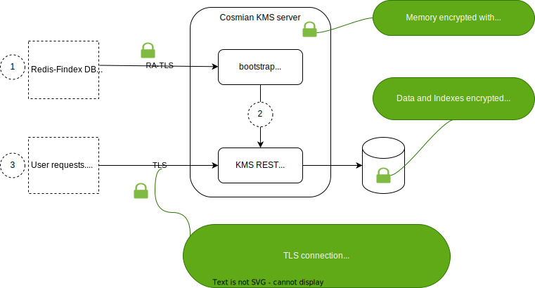

# Zero-trust KMS

The Cosmian KMS is designed to run in the cloud or any zero-trust environment.

The design provides:

- a secure mechanism to provide and keep encryption secrets on the servers
- runtime memory encryption
- verifiability of the correctness of the running environment



## Zero-trust design

The design relies on 3 features:

**Starting the server in bootstrap mode**: This initial phase allows the secure input of secret components, including the database encryption secret, directly into the encrypted machine memory, through a secure connection

**Running the KMS server in a confidential VM**: The KMS runs in a confidential VM, which keeps memory encrypted at runtime using a key concealed in the CPU

**Using an application-level encrypted Redis database:** Using the Redis-With-Findex database type, the data and indexes are encrypted by the main application using keys derived from the previously provisioned database encryption secret.

Confidential VMs are now available at most cloud providers using either AMD SEV-SNP technology or Intel SGX/TDX technology. The Cosmian KMS is compatible with both technologies.

## Zero-trust deployment

To perform a zero-trust deployment, the system administrator must follow the steps below:

- Install a KMS server in an enclave confidential VM and start the server in bootstrap mode
- Provision the database configuration details
- Add more KMS servers to the deployment if need be

### Installing and starting a KMS server

The KMS servers must be installed in confidential VMs and started in bootstrap mode.

- To start the database server in bootstrap mode, use the `-use-bootstrap-server` option (see [bootstrap](./bootstrap.md) from more details) on the docker started in the confidential VM :

```bash
docker run -p 9998:9998 --name kms ghcr.io/cosmian/kms:4.10.0 --use-bootstrap-server
```

- To use the TLS generation using LetsEncrypt inside the confidential VM add the arguments described in [tls](./tls.md#using-the-certificates-bot)

### Example on SGX

On SGX, for example, you could install and start the KMS server using a docker build from [github](https://github.com/Cosmian/kms/tree/main/sgx):

1. Download the KMS repository
2. Build the docker:

```bash
sudo docker build -f sgx/Dockerfile.sgx -t enclave-kms .
```

3. Run the docker

```bash
# Plain text directory
mkdir -p public_data/
# Encrypted directory
mkdir -p private_data/

# Start the docker
sudo docker run \
    --device /dev/sgx_enclave \
    --device /dev/sgx_provision \
    -v /var/run/aesmd:/var/run/aesmd/ \
    -v /opt/cosmian-internal:/opt/cosmian-internal \
    -v $PWD/public_data:/root/public_data \
    -v $PWD/private_data:/root/private_data \
    -p80:80 \
    -p9998:9998 \
    -it enclave-kms
```

4. (KMS owner) Configure the bootstrap server remotely. Don't forget to edit the cli configuration file with the proper measurement values and the KMS server url. This step also transparently verifies the RA-TLS connection.

```bash
KMS_CLI_CONF=sgx/kms-test.json ckms bootstrap-start \
                                    --database-type redis-findex \
                                    --database-url redis://redis-server:6379 \
                                    --redis-master-password master-password \
                                    --redis-findex-label label
```

5. (KMS user) Verify the trustworthiness of the KMS. Don't forget to edit the cli configuration file with the proper measurement values and the KMS server url.

```bash
KMS_CLI_CONF=sgx/kms-test.json ckms verify
```

You don't need to redo that step if the KMS is not updated.

6. (KMS user) Use the KMS

```bash
KMS_CLI_CONF=sgx/kms-test.json ckms sym keys create
```

### Horizontal scaling

To scale the deployment horizontally,

- Configure the first server according to the workflow below
- Install new servers according to the [high-availability documentation](./high_availability_mode.md), then repeat the workflow below for each server starting at the **Provisioning phase**.

All servers must run the **same version** of the software.

## Configuration workflow

Once in bootstrap mode inside a confidential VM, the bootstrap server will generate a new secret key *sk* derived from the software's signature and a CPU secret key linked to the manufacturer. Two machines using the same CPU model and the same version of the software will derive the same secret key *sk*.

Please note that the secret key *sk* is not available to anyone outside the bootstrap server encrypted memory: to recover the key, an external attacker must modify the software, changing its fingerprint and making it impossible to derive the same secret key *sk*.

Using the secret *sk*, the bootstrap server will generate a self-signed certificate (the *bootstrap certificate*) and open an HTTPS port. This port will expose a configuration API the system administrator uses to complete the server configuration.

In addition to the standard fields of a web server certificate, the bootstrap certificate contains a *quote,* which is a cryptographic proof signed by a CPU secret key, that:

- The server is a genuine confidential VM
- The correct software is running inside the confidential VM

HTTPS connections with these types of certificates are called *RA-TLS* connections, where *RA* stands for *Remote Attestation*.

Before sending any configuration data to the bootstrap server, the system administrator attests the connection by verifying the *quote* of the bootstrap certificate. This can easily be done [using the `ckms` client CLI](./cli/main_commands.md#bootstrap-start).

After attesting the RA-TLS connection, the system administrator sends the database configuration details to the bootstrap server. Please check the [bootstrap mode documentation](./bootstrap.md) for more details on performing this operation.

The bootstrap server will then start the main KMS server, which will open an HTTPS port using the API TLS certificate; this port exposes the API endpoints to the users. The API TLS certificate is generating by the secure environment and signed by LetsEncrypt.

The main KMS server is now started, and the bootstrap will shutdown.

## Attesting the correctness of the installation

The users, like the system administrator, can attest to the correctness of the installation by using the `ckms` CLI `verify` subcommand. Please check the [`ckms` documentation](./cli/cli.md) for more details on performing this operation.

The `ckms` CLI will connect to the API endpoint `/quote` to get the attestation report and verify it locally. Once verified, the TLS certificate used to query this endpoint will be the only one accepted for any further queries. This way, the user is confident that the KMS is still trusted at any time.
