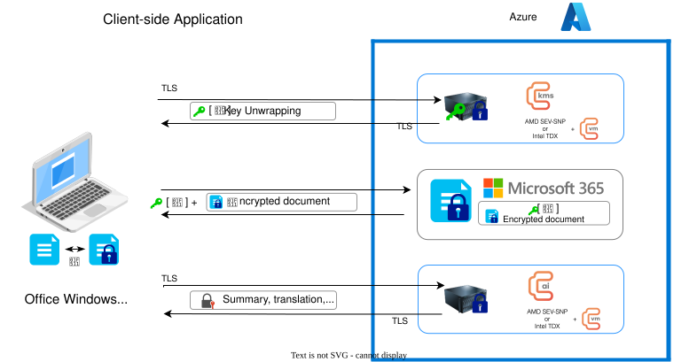
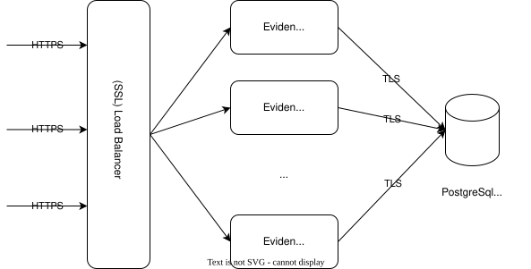

<!-- _class: title -->
<!-- _paginate: false -->

# Eviden KMS

## High-Performance, FIPS 140-3 Compliant Key Management System

<br/>

**Version 5.x** · Written in Rust · Source-available on GitHub

*Eviden — an Atos business*

---

<!-- Slide 2 -->
# What is Eviden KMS?

<div class="cols">
<div class="col">

### Three-in-One Platform

**Key Management System (KMS)**
Centralised lifecycle management for symmetric keys, asymmetric key pairs, and certificates — from creation to secure destruction.

**Interoperability Hub**
KMIP 1.0–2.1 + cloud integrations (AWS XKS, Azure EKM/DKE, Google CSE/CMEK) + database TDE (Oracle, PostgreSQL/EDB/IRIS, MongoDB, MySQL) — one KMS for every vendor.

**Hardware Security Module (HSM) Bridge**
Hardware-backed key protection out of the box — Proteccio, Crypt2Pay, Utimaco, Nitrokey. All application keys wrapped by HSM master keys; crypto operations never exposed directly.

</div>
<div class="col">

### At a Glance

| Property | Value |
|---|---|
| Language | Rust (memory-safe) |
| Protocol | KMIP 1.0 → 2.1 |
| Compliance | **FIPS 140-3** · CSPN (ANSSI, upcoming) |
| API | REST · KMIP TTLV · OpenAPI 3.1 |
| Clients | CLI · Web UI · WASM |
| Deployment | Docker · Deb/RPM · Cloud Marketplace |
| License | BSL 1.1 (source available) |
| Origin | 🇪🇺 Developed in France |

</div>
</div>

---

<!-- Slide 3 -->
# Why Eviden KMS?

<div class="cols">
<div class="col">

🦀 **Performance — Built in Rust**
Low-latency cryptography, zero-copy serialisation, millions of ops/sec on commodity hardware.

🔒 **Trust by Design**
FIPS 140-3 mode by default (OpenSSL FIPS provider, cert #4779/#4776). CSPN evaluation in progress (ANSSI). Only NIST-approved algorithms in production.

🔌 **Interoperability**
Full KMIP 1.0–2.1, PKCS#11 module, WASM client, OpenAPI 3.1/Swagger UI, PyKMIP-compatible endpoint.

</div>
<div class="col">

🏦 **HSM-First Architecture**
Optional hardware-wrapping of all application keys — Utimaco, Proteccio, Nitrokey HSM 2, Crypt2Pay and more.

☁️ **Cloud-Native**
Official Docker image, stateless horizontal scaling, OpenTelemetry metrics & traces, HAProxy + Keepalived HA.

🌐 **End-to-End Tooling**
Server + CLI (`ckms`) + Web UI for complete operator and developer experience with no third-party tooling required.

</div>
</div>

---

<!-- Slide 4 -->
# System Architecture

<div class="img-center">



</div>

> HTTP/TLS — Actix-web → TTLV deserialiser → operation dispatcher → KMS core → DB / crypto / HSM

---

<!-- Slide 5 -->
# Supported Algorithms

<div class="cols">
<div class="col">

### Classical (FIPS Mode ✅)

| Category | Algorithms |
|---|---|
| Symmetric enc. | AES-GCM, AES-XTS, AES-GCM-SIV |
| Key wrap | AES-KW (RFC 3394), AES-KWP (RFC 5649) |
| Asymmetric enc. | RSA-OAEP (2048 / 3072 / 4096) |
| Signatures | ECDSA (P-256/384/521), EdDSA (Ed25519/448), RSASSA-PSS |
| Key derivation | PBKDF2, HKDF |
| Hash | SHA-2, SHA-3 |
| MAC | HMAC-SHA-2 |

</div>
<div class="col">

### Post-Quantum (Non-FIPS mode)

| Algorithm | Standard | Use |
|---|---|---|
| ML-KEM-512/768/1024 | FIPS 203 | Key encapsulation |
| ML-DSA-44/65/87 | FIPS 204 | Digital signature |
| SLH-DSA (12 variants) | FIPS 205 | Signature (stateless) |
| Covercrypt | Cosmian | Attribute-based enc. |
| FPE FF1 | NIST SP 800-38G | Format-preserving enc. |
| ChaCha20-Poly1305 | RFC 8439 | Authenticated enc. |

**Hybrid KEM**: ML-KEM + X25519 / P-256 for migration safety.

</div>
</div>

---

<!-- Slide 6 -->
# KMIP Protocol Support

**Cosmian KMS supports KMIP versions: 1.0 · 1.1 · 1.2 · 1.3 · 1.4 · 2.0 · 2.1**

**Baseline Server Profile:** ✅ Fully compliant (all 9 required + 18/18 optional operations)

| Operation | 1.0 | 1.1–1.4 | 2.0–2.1 | | Operation | 1.0 | 1.1–1.4 | 2.0–2.1 |
|---|:---:|:---:|:---:|---|---|:---:|:---:|:---:|
| Create | ✅ | ✅ | ✅ | | Decrypt | — | ✅ | ✅ |
| Create Key Pair | ✅ | ✅ | ✅ | | Encrypt | — | ✅ | ✅ |
| Register | ✅ | ✅ | ✅ | | Sign | — | ✅ | ✅ |
| Get | ✅ | ✅ | ✅ | | MAC | — | ✅ | ✅ |
| Locate | ✅ | ✅ | ✅ | | Certify | ✅ | ✅ | ✅ |
| Destroy | ✅ | ✅ | ✅ | | Derive Key | ✅ | ✅ | ✅ |
| Activate / Revoke | ✅ | ✅ | ✅ | | Re-key | — | ✅ | ✅ |
| Query / Discover | ✅ | ✅ | ✅ | | Export | — | — | ✅ |

Both **binary TTLV** and **JSON TTLV** encodings supported. Interactive **Swagger UI** at `/swagger-ui`.

---

<!-- Slide 7 -->
# Key Lifecycle Management

<div class="img-center">



</div>

<div class="cols">
<div class="col">

### KMIP States

- **Pre-Active** — created/registered, not yet usable for crypto
- **Active** — full encrypt / decrypt / sign capability
- **Deactivated** — decrypt legacy data only (no new encryption)
- **Compromised** — forensic decrypt only, key considered breached
- **Destroyed** — key material **securely zeroized**, ID retained for audit

</div>
<div class="col">

### Access Control

Every managed object follows this KMIP lifecycle. Object ownership + fine-grained **grant/revoke** permissions per user or group. Multi-tenancy enforced at the database layer.

</div>
</div>

---

<!-- Slide 8 -->
# Cloud Provider Integrations

<div class="cols">
<div class="col">

<div class="img-center">



</div>

</div>
<div class="col">

### Zero-Trust Key Models

| Model | Cloud | Key location |
|---|---|---|
| **XKS** live proxy | AWS | Never enters AWS |
| **EKM** live proxy | GCP / Azure | Never enters cloud |
| **CSE** live proxy | Google Workspace | KMS-only |
| **DKE** live proxy | Microsoft 365 | Both keys required |
| **BYOK** import | AWS / GCP / Azure | Copy in cloud |
| **CMK** lifecycle | All | Cloud-generated |

> With **XKS** and **EKM**, every AWS/GCP service (S3, EBS, RDS, BigQuery, Cloud SQL…) routes encryption through Eviden KMS automatically — no per-service integration needed.

</div>
</div>

---

<!-- Slide 9 -->
# AWS External Key Store (XKS)

<div class="cols">
<div class="col">

### How XKS Works

```
AWS Service (S3 / EBS / RDS…)
        │  encrypt / decrypt request
        ▼
    AWS KMS
        │  XKS Proxy API call
        ▼
  Eviden KMS  ◄── key material NEVER
        │         enters AWS
        ▼
  Your database
  (encrypted keys)
```

**One integration — all AWS services covered automatically.**

</div>
<div class="col">

### XKS Coverage

All KMS-capable AWS services are covered by the single XKS endpoint:

- Amazon S3, EBS, RDS, Aurora
- DynamoDB, Secrets Manager
- SQS, SNS, Redshift
- OpenSearch, EMR, Glue
- Lambda environment variables
- …and any future XKS-capable service

### Azure Double Key Encryption

M365 / Purview requires **both** Microsoft's key **and** your Eviden KMS key to decrypt. Losing one key renders data permanently unreadable — true dual-control.

</div>
</div>

---

<!-- Slide 10 -->
# Database Integrations

## Transparent Data Encryption (TDE) & Queryable Encryption

| Database | Integration | KMIP | Mechanism |
|---|---|:---:|---|
| **Oracle Database** | TDE via PKCS#11 | — | PKCS#11 module, key never leaves KMS |
| **Microsoft SQL Server** | External Key Management (EKM) | — | PKCS#11 provider for Windows |
| **MongoDB** | CSFLE / Queryable Encryption | 1.0 | Field-level encryption, BSON-native |
| **MySQL Enterprise** | TDE via KMIP | 1.1 | Native KMIP keyring plugin |
| **Percona PostgreSQL** | TDE via KMIP | 1.4 | Percona TDE KMIP keyring plugin |
| **EDB Postgres Adv. Server** | TDE via KMIP | 2.1 | AES-256 CBC, mTLS, non-FIPS |
| **InterSystems IRIS** | Database encryption via KMIP | 2.0 | mTLS, symmetric keys, non-FIPS |

### How it Works

```
Database Engine  ──KMIP / PKCS#11──►  Eviden KMS  ──wrap/unwrap──►  HSM
      │                                    │
  Encrypted                           Key material
  data at rest                       never in DB
```

---

<!-- Slide 11 -->
# Storage & Disk Encryption

<div class="cols">
<div class="col">

### Disk Encryption

| Product | Protocol | Notes |
|---|---|---|
| **VeraCrypt** | PKCS#11 | Virtual encrypted volumes |
| **LUKS** | PKCS#11 | Linux full-disk encryption |
| **Cryhod** | Native | Windows/Linux disk encryption |

### Storage Systems

| Product | KMIP | Notes |
|---|---|---|
| **VMware vCenter** | 1.1 | Trust Key Provider |
| **Synology DSM** | 1.2 | NAS volume encryption |
| **VAST Data** | 1.4 | Scale-out storage EKM |
| **Veeam Backup** | 1.4 | Backup encryption keys |

</div>
<div class="col">

### Other Integrations

| Product | Notes |
|---|---|
| **FortiGate / FortiOS** | KMIP 1.0–1.4, network appliances |
| **OpenSSH** | Certificate-based auth |
| **S/MIME** | Email encryption (PKCS#12 export) |
| **PyKMIP** | Dev/test & Synology DSM |
| **Windows CNG KSP** | Intune SCEP — private keys in KMS |

<br/>

### PKCS#11 Module

Cosmian ships a native **PKCS#11 module** (`cosmian_pkcs11`) enabling any PKCS#11-capable application to use Eviden KMS as its key store — no code changes required.

</div>
</div>

---

<!-- Slide 12 -->
# HSM Support

<div class="cols">
<div class="col">

<div class="img-center">



</div>

</div>
<div class="col">

### Supported Hardware

| HSM | Status |
|---|:---:|
| **Proteccio** (Trustway/Eviden) | ✅ |
| **Crypt2Pay** (Trustway/Eviden) | ✅ |
| **Utimaco SecurityServer** | ✅ |
| **Nitrokey HSM 2 / SmartCard-HSM** | ✅ |
| **SoftHSM2** (dev/test) | ✅ |
| AWS CloudHSM | 🚧 |
| Azure Dedicated HSM | 🚧 |

### Value Proposition

- **At rest**: App keys wrapped by HSM master key, stored encrypted in DB
- **At runtime**: KMS unwraps on demand via PKCS#11 — HSM never exposed directly
- **Scalability**: Hundreds of concurrent KMS requests handled without HSM bottlenecks

</div>
</div>

---

<!-- Slide 13 -->
# Public Key Infrastructure (PKI)

<div class="cols">
<div class="col">

<div class="img-center">



</div>

</div>
<div class="col">

### Capabilities

- **Issue** root and intermediate CAs
- **Sign** leaf certificates (TLS, S/MIME, mTLS client auth)
- **Cross-algorithm PKI** — CA and leaf can use *different* algorithm families
- **Validate** full certificate chains
- **Revoke** with CRL support
- **Export** as PEM, DER, PKCS#12 (modern & legacy)

### Classical + Post-Quantum

| Family | Algorithms |
|---|---|
| RSA | 2048 / 3072 / 4096 |
| EC | P-256 / P-384 / P-521 |
| EdDSA | Ed25519 / Ed448 |
| **ML-DSA** | 44 / 65 / 87 (FIPS 204) |
| **SLH-DSA** | 12 variants (FIPS 205) |
| **ML-KEM** | 512 / 768 / 1024 (FIPS 203) |

</div>
</div>

---

<!-- Slide 14 -->
# Data Anonymization & Format-Preserving Encryption

<div class="cols">
<div class="col">

### Anonymization Methods *(non-FIPS)*

| Method | Use Case |
|---|---|
| **Hash** (SHA-2/3, Argon2) | Irreversible pseudonymization |
| **FPE FF1** | Tokenize credit cards, SSNs — format preserved |
| **Noise addition** | Differential privacy (Gaussian / Laplace) |
| **Word mask** | Replace sensitive words with `XXXX` |
| **Word tokenize** | Deterministic token replacement |
| **Pattern mask** | Regex-based substring replacement |
| **Aggregate number** | Round to nearest power of ten |
| **Aggregate date** | Truncate to year / month |

</div>
<div class="col">

### Format-Preserving Encryption (FPE FF1)

```bash
# Encrypt a credit card number — output stays 16 digits
ckms fpe encrypt \
  --key-id <fpe-key-id> \
  --alphabet numeric \
  --data "4532015112830366"
# → "7319284650173891"  (still 16 digits!)

# Decrypt back
ckms fpe decrypt \
  --key-id <fpe-key-id> \
  --alphabet numeric \
  --data "7319284650173891"
# → "4532015112830366"
```

> Ideal for encrypting data in **existing databases** without changing column types or application queries.

</div>
</div>

---

<!-- Slide 15 -->
# High Availability

<div class="cols">
<div class="col">

<div class="img-center">



</div>

</div>
<div class="col">

### Architecture

```
Clients
   │
Virtual IP (VRRP / Keepalived)
   │
Load Balancer (HAProxy)
   │  TCP mode — KMIP TLS passthrough
   ├─ KMS Node 1
   ├─ KMS Node 2
   └─ KMS Node N
            │
    Shared Database
  (PostgreSQL / SQLite / Redis-findex)
```

### Failover Characteristics

| Event | Recovery time |
|---|---|
| Active HAProxy fails | **~2 seconds** (VIP moves) |
| KMS node fails | **~9 seconds** (health check) |
| Add new KMS node | **0 seconds** client-side (stateless) |

Health endpoint: `GET /health` on port **9998**

</div>
</div>

---

<!-- Slide 16 -->
# Get Started

<div class="cols">
<div class="col">

### 🐳 30-Second Quick Start

```bash
# 1. Start KMS server
docker run -p 9998:9998 ghcr.io/cosmian/kms:latest

# 2. Create an AES-256 key
ckms sym keys create --number-of-bits 256 \
  --algorithm aes --tag my-first-key

# 3. Encrypt a file
ckms sym encrypt --tag my-first-key \
  --output-file secret.enc plaintext.txt
```

Web UI: `http://localhost:9998/ui`

</div>
<div class="col">

### 📦 Deployment Options

| Method | Command / URL |
|---|---|
| Docker | `ghcr.io/cosmian/kms:latest` |
| Debian/RPM | `package.cosmian.com/kms/` |
| AWS Marketplace | search "Eviden KMS" |
| Azure Marketplace | search "Eviden KMS" |
| GCP Marketplace | search "Eviden KMS" |

### 📚 Resources

- **Docs**: `docs.cosmian.com/key_management_system/`
- **API**: `localhost:9998/swagger-ui`
- **GitHub**: `github.com/Cosmian/kms`
- **CLI reference**: `ckms --help`

<span class="badge">FIPS 140-3</span>
<span class="badge">KMIP 1.0–2.1</span>
<span class="badge badge-blue">Open Source CLI</span>
<span class="badge badge-blue">PKCS#11</span>
<span class="badge">Post-Quantum Ready</span>

</div>
</div>
