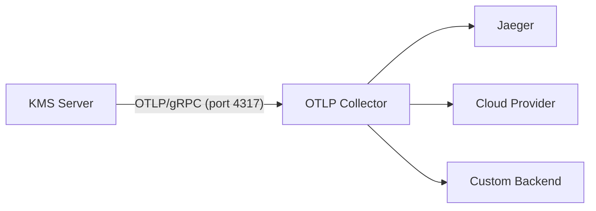

# OTLP Metrics Integration

Cosmian KMS exports metrics via OpenTelemetry Protocol (OTLP) over gRPC. This allows you to send metrics directly to any OTLP-compatible backend without exposing an HTTP endpoint.

## Architecture



## Configuration

### Enable OTLP Metrics in KMS

Configure the OTLP endpoint in your `kms.toml`:

```toml
[logging]
# OTLP endpoint for metrics export
otlp = "http://localhost:4317"
```

Or via environment variable:

```bash
export KMS_OTLP_URL="http://localhost:4317"
export KMS_ENABLE_METERING="true"
```

Or via command-line flag:

```bash
cosmian_kms --otlp http://localhost:4317 --enable-metering
```

### Metrics Export Behavior

- **Automatic**: Metrics are automatically sent when `otlp` URL is configured
- **Interval**: Metrics are pushed every 30 seconds
- **Protocol**: gRPC transport (OTLP/gRPC)
- **No HTTP endpoint**: KMS does not expose any HTTP `/metrics` endpoint

## Quick Start with Docker

### 1. Start the OTLP Stack

```bash
# Start OTLP Collector and Jaeger
docker compose --profile otel-test up -d otel-collector jaeger
```

This starts:

- **OTLP Collector** on host ports 14317 (gRPC) and 14318 (HTTP)
- **Collector Prometheus export** on <http://localhost:18889/metrics>
- **Jaeger UI** on <http://localhost:16686>

### 2. Start KMS with OTLP

```bash
# Configure KMS to send metrics to OTLP Collector
cosmian_kms --otlp-url http://localhost:4317 \
            --database-type sqlite \
            --sqlite-path /tmp/kms-data
```

### 3. View Metrics

- **Jaeger UI**: <http://localhost:16686> (metrics and traces)
- **Collector /metrics**: <http://localhost:18889/metrics>

## Available Metrics

The server exposes the following instruments via OTLP, as implemented in `crate/server/src/core/otel_metrics.rs`.

### KMIP Operations

| Metric                               | Type          | Labels              |
| ------------------------------------ | ------------- | ------------------- |
| `kms.kmip.operations.total`          | counter       | `operation`         |
| `kms.kmip.operations.per_user.total` | counter       | `operation`, `user` |
| `kms.kmip.operation.duration`        | histogram (s) | `operation`         |

> **Note:** The `user` label in `kms.kmip.operations.per_user.total` and `kms.permissions.granted.per_user.total` is a truncated SHA-256 hash of the identity string extracted by the authentication middleware (e.g. an OAuth subject, email address, or service-account identifier), not the raw value. The hash is deterministic (the same user always produces the same label, so per-user trend/cardinality analysis still works) but non-reversible, so it cannot be used to identify a real user from the OTLP backend alone. The authoritative record of which user performed which operation is the audit log, not OTEL metrics.

### Users & Permissions

| Metric                                   | Type            | Labels                    |
| ---------------------------------------- | --------------- | ------------------------- |
| `kms.active.users`                       | up-down counter | —                         |
| `kms.permissions.granted.per_user.total` | counter         | `user`, `permission_type` |
| `kms.permissions.granted.total`          | counter         | —                         |

### Database Metrics

| Metric                            | Type          | Labels                            |
| --------------------------------- | ------------- | --------------------------------- |
| `kms.database.operations.total`   | counter       | `operation`, `backend`, `outcome` |
| `kms.database.operation.duration` | histogram (s) | `operation`, `backend`, `outcome` |

`backend`: `sqlite` · `postgresql` · `mysql` · `redis` — `outcome`: `success` · `error`

### HTTP Metrics

| Metric                      | Type          | Labels                     |
| --------------------------- | ------------- | -------------------------- |
| `kms.http.requests.total`   | counter       | `method`, `path`, `status` |
| `kms.http.request.duration` | histogram (s) | `method`, `path`, `status` |

### Server Health

| Metric                   | Type                   | Labels       |
| ------------------------ | ---------------------- | ------------ |
| `kms.server.uptime`      | counter (monotonic, s) | —            |
| `kms.server.start_time`  | up-down counter        | —            |
| `kms.active.connections` | up-down counter        | —            |
| `kms.errors.total`       | counter                | `error_type` |

### Objects & Keys

| Metric                  | Type  | Labels |
| ----------------------- | ----- | ------ |
| `kms.objects.total`     | gauge | —      |
| `kms.keys.active.count` | gauge | —      |

`kms.keys.active.count` counts all **non-destroyed** key objects (SymmetricKey, PrivateKey,
PublicKey, SplitKey) across all non-terminal states: PreActive, Active, Deactivated, Compromised.

### Cache

| Metric                       | Type    | Labels                |
| ---------------------------- | ------- | --------------------- |
| `kms.cache.operations.total` | counter | `operation`, `result` |

### HSM

| Metric                     | Type    | Labels                   |
| -------------------------- | ------- | ------------------------ |
| `kms.hsm.operations.total` | counter | `operation`, `hsm_model` |

## OTLP Collector Configuration

The `otel-collector-config.yaml` receives metrics from KMS and forwards to backends:

```yaml
receivers:
  otlp:
    protocols:
      grpc:
        endpoint: 0.0.0.0:4317

exporters:
  otlp:
    endpoint: ${env:OTLP_ENDPOINT} # Forward to Jaeger, etc.

service:
  pipelines:
    metrics:
      receivers: [otlp]
      processors: [resource, batch]
      exporters: [otlp, debug]
```

## Cloud Provider Integration

### Send to Datadog

```bash
# Configure OTLP Collector to export to Datadog
export DD_SITE="datadoghq.com"
export DD_API_KEY="your-api-key"

# Update otel-collector-config.yaml
exporters:
  datadog:
    api:
      key: ${env:DD_API_KEY}
      site: ${env:DD_SITE}
```

### Send to New Relic

```bash
export NEW_RELIC_LICENSE_KEY="your-license-key"

# Update otel-collector-config.yaml
exporters:
  otlp:
    endpoint: otlp.nr-data.net:4317
    headers:
      api-key: ${env:NEW_RELIC_LICENSE_KEY}
```

### Send to Grafana Cloud

```bash
export GRAFANA_INSTANCE_ID="your-instance-id"
export GRAFANA_API_KEY="your-api-key"

# Update otel-collector-config.yaml
exporters:
  otlp:
    endpoint: otlp-gateway-${GRAFANA_INSTANCE_ID}.grafana.net:4317
    headers:
      authorization: "Bearer ${GRAFANA_API_KEY}"
```

## Production Deployment

### Security Best Practices

1. **Use TLS for OTLP transport**:

```toml
[logging]
otlp = "https://collector.example.com:4317"
```

1. **Authentication**: Configure API keys in OTLP Collector:

```yaml
exporters:
  otlp:
    headers:
      authorization: "Bearer ${API_TOKEN}"
```

1. **Network isolation**: Run OTLP Collector in private network

### High Availability

Deploy multiple OTLP Collectors with load balancing:

```toml
[logging]
otlp = "https://otlp-lb.example.com:4317"
```

## Troubleshooting

### No metrics appearing

1. **Check KMS logs** for OTLP connection errors:

   ```bash
   cosmian_kms --log-level debug
   ```

2. **Check Collector logs**:

```bash
docker compose --profile otel-test logs -f otel-collector
```

### Metrics export errors

- Ensure `otlp` URL is correct in configuration
- Check network connectivity to OTLP Collector
- Verify Collector has correct exporters configured

## Files Reference

| File                                    | Purpose                                           |
| --------------------------------------- | ------------------------------------------------- |
| `otel-collector-config.yaml`            | OTLP Collector configuration                      |
| `docker-compose.yml`                    | Local development stack (use profile `otel-test`) |
| `crate/server/src/core/otel_metrics.rs` | Metrics instruments and recording helpers         |

## Differences from HTTP /metrics Endpoint

**Previous Architecture** (Removed):

- KMS exposed HTTP `/metrics` endpoint
- External scrapers pulled metrics
- Security concerns with exposed endpoint

**Current Architecture**:

- KMS pushes metrics via OTLP
- No HTTP endpoint exposure
- More secure and flexible
- Cloud-native standard

## Additional Resources

- [OpenTelemetry documentation](https://opentelemetry.io/docs/)
- [OTLP specification](https://opentelemetry.io/docs/specs/otlp/)
- [Jaeger documentation](https://www.jaegertracing.io/docs/)
- [Grafana documentation](https://grafana.com/docs/)
- [Cosmian KMS metrics reference](https://docs.cosmian.com/key_management_system/configuration/otlp-metrics/)
- [Cosmian KMS monitoring documentation](https://docs.cosmian.com/key_management_system/configuration/monitoring-setup/)
