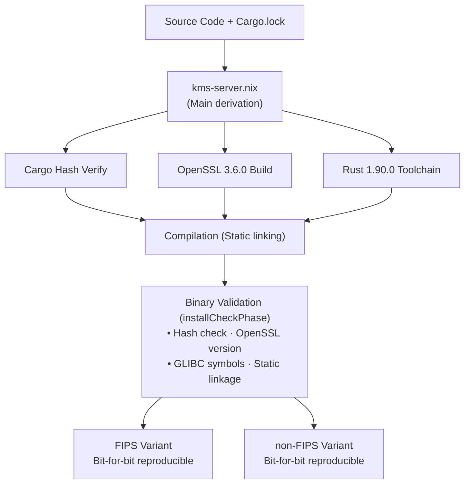
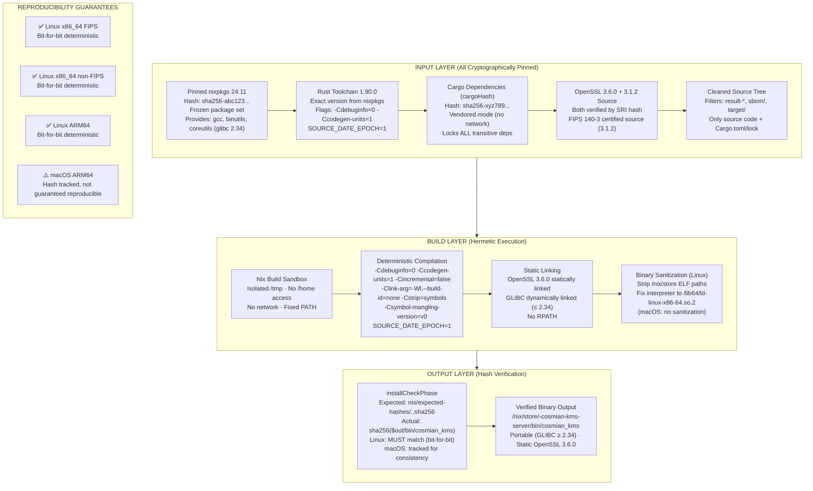
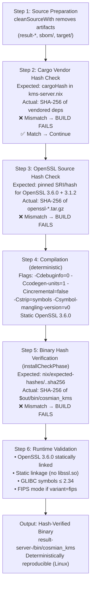
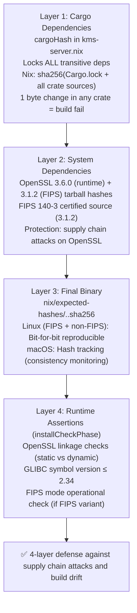
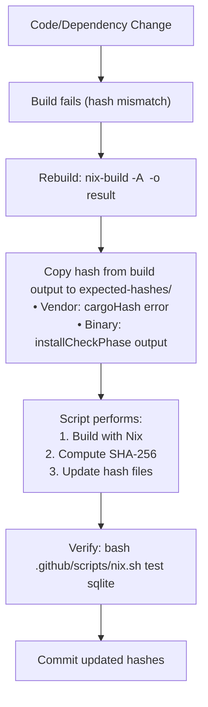
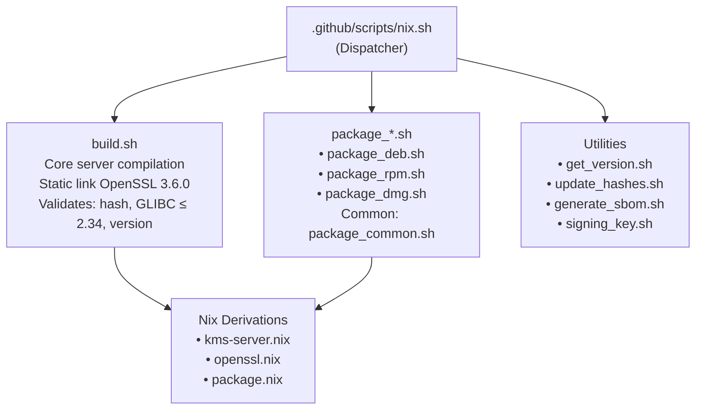
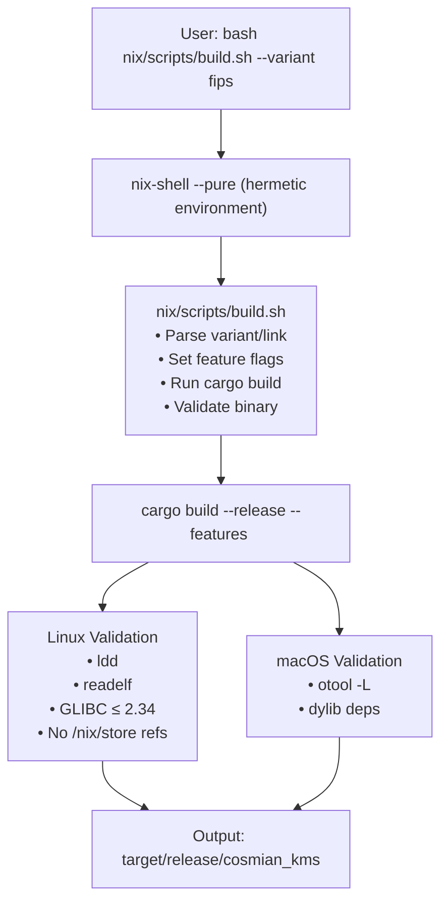
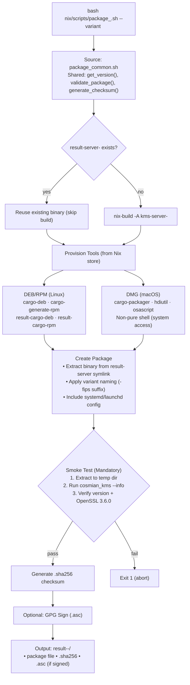
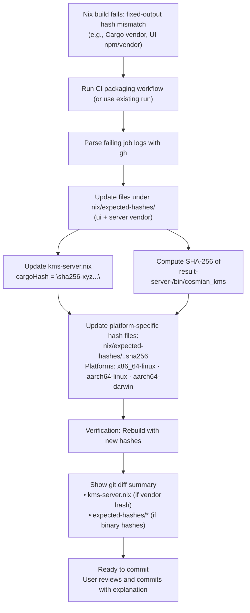
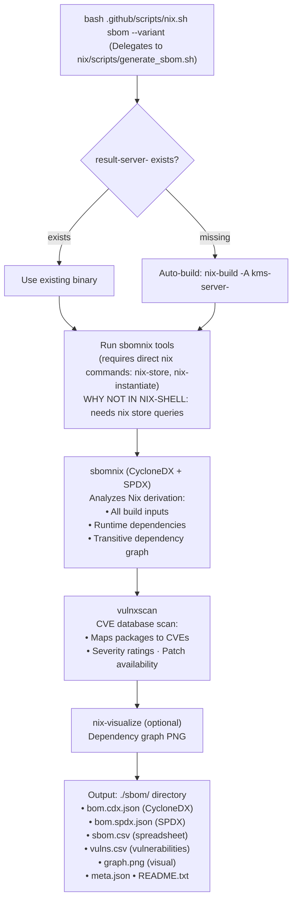

# Nix builds: reproducibility, offline guarantees & idempotent packaging

This directory contains the reproducible Nix derivations and helper scripts used to build and package the Cosmian KMS server.

## Quick Visual Overview



**📊 For detailed visual flows, see sections below:**

- [Hash Verification Flow](#hash-verification-flow) - How hashes are enforced
- [Offline Build Process](#offline-build-visual-flow) - Air-gapped workflow
- [Reproducibility Architecture](#reproducibility-architecture-diagram) - Deterministic build components

---

[TOC]

---

## Why Nix?

### The Challenge

Modern software projects face critical challenges in build reproducibility and supply chain security:

- **Dependency drift**: "Works on my machine" due to different tool versions
- **Supply chain attacks**: Hidden modifications in build artifacts
- **Audit requirements**: Security audits and compliance frameworks benefit from verifiable, bit-for-bit reproducible builds
- **Platform fragmentation**: Supporting multiple Linux distributions, macOS, and architectures

### Why We Chose Nix Over Alternatives

| Aspect                       | Nix                                               | Docker/Containers         | Traditional Package Managers |
| ---------------------------- | ------------------------------------------------- | ------------------------- | ---------------------------- |
| **Reproducibility**          | ✅ Bit-for-bit identical builds                    | ⚠️ Image layers can vary   | ❌ Version drift common       |
| **Supply Chain Security**    | ✅ Cryptographic hash verification                 | ⚠️ Registry trust required | ❌ Often no verification      |
| **Portability**              | ✅ Pure function approach, no /nix/store in output | ⚠️ Container overhead      | ❌ Platform-specific          |
| **Development + Production** | ✅ Same tool for both                              | ❌ Separate workflows      | ❌ Different environments     |
| **Offline Builds**           | ✅ After pre-warm                                  | ⚠️ Image caching needed    | ❌ Registry dependency        |
| **Audit Trail**              | ✅ Full dependency graph                           | ⚠️ Layer history           | ❌ Limited tracking           |
| **Community**                | ✅ 6,000+ contributors                             | ✅ Widespread              | ✅ Varies                     |
| **Open Source**              | ✅ MIT License                                     | ✅ Apache 2.0              | ✅ Varies                     |

**Key Decision Factors for Cosmian KMS**:

1. **Supply Chain Security & Auditability**: Reproducible builds with cryptographic hash verification enable independent verification of binaries. While not required by FIPS 140-3, this provides strong supply chain security guarantees.

2. **Static OpenSSL Linking**: KMS links against OpenSSL 3.6.0, but needs to bundle the OpenSSL 3.1.2 FIPS provider without runtime dependencies (official FIPS provider version; no more recent FIPS provider version). Nix allows precise control over linkage and eliminates `/nix/store` paths in final binaries.

3. **Multi-Platform Support**: Single build system for Linux (x86_64, ARM64) and macOS (Apple Silicon) without Docker limitations.

4. **Supply Chain Transparency**: Every dependency is pinned by cryptographic hash, making tampering immediately visible.

5. **Developer Experience**: Same toolchain for local development and CI/CD, eliminating "works in CI but not locally" issues.

### History & Origins

**Created**: 2003 by **Eelco Dolstra** as part of his PhD research at Utrecht University, Netherlands

**Original Problem**: Dolstra's PhD thesis "[The Purely Functional Software Deployment Model](https://edolstra.github.io/pubs/phd-thesis.pdf)" (2006) addressed the fundamental problem: *"How to reliably deploy software with all its dependencies while avoiding conflicts?"*

**Key Innovation**: Treating software packages as **pure functions** - same inputs always produce identical outputs. This mathematical approach to package management was revolutionary.

**Evolution**:

- **2003**: Nix package manager created
- **2006**: PhD thesis published, establishing theoretical foundation
- **2008**: NixOS operating system built entirely on Nix principles
- **2015**: Nix 2.0 - improved user experience, flakes experimental feature
- **2020-present**: Explosive growth in enterprise adoption (Shopify, Meta, Replit, etc.)

**Current Governance**: Community-driven, overseen by the NixOS Foundation (nonprofit established 2015)

### Core Philosophy

```text
f(source, dependencies, build-system) = /nix/store/<hash>-package

Same inputs → Same hash → Bit-for-bit identical output
```

This purely functional approach means:

- **No global state**: Each package isolated in `/nix/store/<hash>-name`
- **No dependency conflicts**: Multiple versions coexist peacefully
- **Atomic upgrades/rollbacks**: Transaction-like package operations
- **Reproducible**: Same source + config = identical binary (even across machines/years)

### Major Projects Using Nix

#### Technology Companies

| Company                 | Use Case                                         | Scale                   |
| ----------------------- | ------------------------------------------------ | ----------------------- |
| **Meta (Facebook)**     | Internal tooling, developer environments         | Thousands of developers |
| **Shopify**             | Production infrastructure, Ruby deployments      | Company-wide adoption   |
| **Replit**              | Online IDE infrastructure, language environments | Millions of users       |
| **Tweag**               | Consulting, builds for Fortune 500 clients       | Enterprise deployments  |
| **Cachix**              | Commercial Nix binary cache service              | Nix ecosystem           |
| **Determinate Systems** | Enterprise Nix support and tooling               | Commercial Nix vendor   |

#### Open Source Projects

| Project          | Category           | Why Nix                                        |
| ---------------- | ------------------ | ---------------------------------------------- |
| **Nixpkgs**      | Package repository | 80,000+ packages - largest curated package set |
| **NixOS**        | Linux distribution | Declarative OS configuration, atomic updates   |
| **Hydra**        | CI/CD system       | Official Nix continuous integration            |
| **Home Manager** | Dotfile management | Reproducible user environments                 |
| **IOG Cardano**  | Blockchain         | Deterministic builds for financial software    |
| **Serokell**     | Haskell projects   | Hermetic functional programming builds         |
| **IOHK**         | Cryptocurrency     | Cryptographic verification requirements        |

#### Research & Academia

- **Utrecht University** (Netherlands): Original birthplace, ongoing research
- **TU Delft** (Netherlands): Distributed systems research
- **INRIA** (France): Software deployment research
- **Various PhD programs**: Reproducible research builds

#### Government & High-Assurance

- **European Commission**: Open source infrastructure projects
- **U.S. Department of Defense**: Exploring for high-assurance systems
- **CERN**: Scientific computing reproducibility

### Why Nix Matters for Cosmian KMS

#### Reproducible Builds

Both FIPS and non-FIPS Linux builds are **bit-for-bit deterministic**:

```bash
# Developer build on laptop (Linux x86_64)
nix-build -A kms-server-fips-static-openssl -o result-server-fips
# SHA256: 528e0f20...

# CI build on GitHub Actions (same platform)
nix-build -A kms-server-fips-static-openssl -o result-server-fips
# SHA256: 528e0f20... ✅ IDENTICAL

# Non-FIPS builds are also deterministic
nix-build -A kms-server-non-fips-static-openssl -o result-server-non-fips
# SHA256: a921942f... ✅ REPRODUCIBLE

# Security team rebuild 6 months later (same commit)
nix-build -A kms-server-fips-static-openssl -o result-server-fips
# SHA256: 528e0f20... ✅ STILL IDENTICAL
```

This **bit-for-bit reproducibility** is essential for:

- **Supply chain security**: Detect any tampering in build process
- **Independent verification**: Anyone can verify published binaries match source code
- **Audit transparency**: Build artifacts can be independently reproduced and verified

#### Dependency Transparency

Every dependency (80+ Rust crates, OpenSSL, glibc) is pinned by cryptographic hash:

```nix
# nix/kms-server.nix
cargoHash = "sha256-xyz789...";  # Locks ALL Cargo dependencies

# OpenSSL note:
# - KMS links against OpenSSL 3.6.0 (runtime/library)
# - FIPS variants also ship the OpenSSL 3.1.2 FIPS provider + fipsmodule.cnf
openssl36 = opensslPkgs.callPackage ./openssl.nix {
   static = true;
   version = "3.6.0";
   enableLegacy = true;
   srcUrl = "https://package.cosmian.com/openssl/openssl-3.6.0.tar.gz";
   sha256SRI = "sha256-tqX0S362nj+jXb8VUkQFtEg3pIHUPYHa3d4/8h/LuOk=";
   expectedHash = "b6a5f44b7eb69e3fa35dbf15524405b44837a481d43d81daddde3ff21fcbb8e9";
};

openssl312 = opensslPkgs.callPackage ./openssl.nix {
   static = true;
   version = "3.1.2";
};
```

Any change to any dependency triggers hash mismatch → immediate detection.

#### Offline Air-Gapped Builds

After initial pre-warm:

```bash
# Online phase (once)
bash .github/scripts/nix.sh package deb

# Disconnect network
# Later, offline phase
export NO_PREWARM=1
bash .github/scripts/nix.sh package deb  # ✅ Works perfectly
```

Critical for:

- **Secure environments**: Package in isolated networks
- **Disaster recovery**: Reproduce builds without external dependencies
- **Compliance**: Prove no external influence during build

---

Goals:

- **Bit-for-bit deterministic builds** on Linux (both FIPS and non-FIPS)
- Native hash verification inside the Nix derivation (installCheckPhase)
- Fully offline packaging after first prewarm
- Idempotent repeated packaging (no rebuild/download) via reuse & NO_PREWARM
- Unified DEB/RPM logic (single common script)
- Rust toolchain provisioned by Nix (no rustup/network)

---

## Build reproducibility foundations

### How reproducible builds work

All Linux builds (FIPS and non-FIPS) achieve bit-for-bit deterministic reproducibility.

`nix/kms-server.nix` builds binaries inside a hermetic, pinned environment with controlled inputs:

1. **Pinned nixpkgs (24.11)**: Frozen package set prevents upstream drift (Linux builds target glibc 2.34)
2. **Source cleaning**: `cleanSourceWith` removes non-input artifacts (`result-*`, reports, caches)
3. **Locked dependencies**: Cargo dependency graph frozen via `cargoHash` (reproducible vendoring)
4. **Deterministic compilation flags**: Rust codegen flags eliminate non-determinism:
   - `-Cdebuginfo=0` — No debug symbols (timestamps, paths)
   - `-Ccodegen-units=1` — Single codegen unit (deterministic order)
   - `-Cincremental=false` — No incremental compilation cache
   - `-C link-arg=-Wl,--build-id=none` — No build-id section
   - `-C strip=symbols` — Strip all symbols
   - `-C symbol-mangling-version=v0` — Stable symbol mangling
   - `SOURCE_DATE_EPOCH` — Normalized embedded timestamps
5. **Pinned OpenSSL 3.6.0 (runtime) + 3.1.2 (FIPS provider)**: Fetched by SRI hash (FIPS 140-3 certified)
   - Note: OpenSSL 3.1.2 is kept for the FIPS provider.
6. **Sanitized binaries**: RPATH removed, interpreter fixed to avoid volatile store paths
7. **No host-path leakage**: Build uses only `/build` and `/tmp` remap prefixes (no workspace paths in derivation)

**Result**: Identical inputs ⇒ identical binary hash. Hash drift always means an intentional or accidental input change.

### Reproducibility Architecture Diagram



### Build hash inventory

Cargo/UI vendor hashes are committed in the repository and verified during builds. Expected **binary** hashes can also be committed under `nix/expected-hashes/` when strict deterministic enforcement is enabled; otherwise the build still computes and writes the actual binary hash to `$out/bin/` for review/copying.

| Hash Type             | Purpose                                                 | Location                                                   | Example (x86_64-linux FIPS)                                        |
| --------------------- | ------------------------------------------------------- | ---------------------------------------------------------- | ------------------------------------------------------------------ |
| **Cargo vendor**      | Reproducible Rust dependencies                          | `nix/kms-server.nix`                                       | `sha256-NAy4vNoW7nkqJF263FkkEvAh1bMMDJkL0poxBzXFOO8=`              |
| **OpenSSL sources**   | OpenSSL 3.6.0 (runtime) + OpenSSL 3.1.2 (FIPS provider) | `nix/kms-server.nix` + `nix/openssl.nix`                   | `sha256-tqX0S362nj+jXb8VUkQFtEg3pIHUPYHa3d4/8h/LuOk=`              |
| **Binary (FIPS)**     | Deterministic FIPS server executable                    | `nix/expected-hashes/cosmian-kms-server.fips.static-openssl.x86_64.linux.sha256`     | `528e0f2019769afb8016bb822f640b2b8b5c5711a0e13f59062c84f9b772bed6` |
| **Binary (non-FIPS)** | Deterministic non-FIPS server executable                | `nix/expected-hashes/cosmian-kms-server.non-fips.static-openssl.x86_64.linux.sha256` | `a921942fd81bedca3438789be5580bde794d5569ce3e955f692d44391f99ff02` |

Platform-specific binary hashes:

| Platform       | Variant  | Hash File                                                    | Enforced At          | Deterministic?                 |
| -------------- | -------- | ------------------------------------------------------------ | -------------------- | ------------------------------ |
| x86_64-linux   | FIPS     | `nix/expected-hashes/cosmian-kms-server.fips.static-openssl.x86_64.linux.sha256`       | `installCheckPhase`  | ✅ Yes (bit-for-bit)            |
| x86_64-linux   | non-FIPS | `nix/expected-hashes/cosmian-kms-server.non-fips.static-openssl.x86_64.linux.sha256`   | `installCheckPhase`  | ✅ Yes (bit-for-bit)            |
| aarch64-linux  | FIPS     | `nix/expected-hashes/cosmian-kms-server.fips.static-openssl.aarch64.linux.sha256`      | `installCheckPhase`  | ✅ Yes (bit-for-bit)            |
| aarch64-linux  | non-FIPS | `nix/expected-hashes/cosmian-kms-server.non-fips.static-openssl.aarch64.linux.sha256`  | `installCheckPhase`  | ✅ Yes (bit-for-bit)            |
| aarch64-darwin | FIPS     | `nix/expected-hashes/cosmian-kms-server.fips.static-openssl.aarch64.darwin.sha256`     | Not enforced (macOS) | ⚠️ No (macOS builds)            |
| aarch64-darwin | non-FIPS | `nix/expected-hashes/cosmian-kms-server.non-fips.static-openssl.aarch64.darwin.sha256` | Not enforced (macOS) | ⚠️ No (macOS builds)            |

**Note**:

- The Cargo vendor hash may differ between macOS and Linux due to platform-specific dependencies
- OpenSSL and binary hashes are platform-specific by design
- Expected-binary-hash enforcement is opt-in (via `enforceDeterministicHash`) and only runs on Linux
- **All Linux builds (FIPS and non-FIPS) are bit-for-bit deterministic**; macOS hashes are tracked for consistency but not reproducibility guarantees

### Hash verification flow

During the build process, Nix enforces all hashes at multiple stages:



#### Hash Verification Details



**Update workflow** (automated with nix.sh update-hashes or standalone script):



Tip: for a quick end-to-end check after updates, use `bash .github/scripts/nix.sh test sqlite` or build a package with `bash .github/scripts/nix.sh package`.

Hash enforcement is configurable: some expected-hash checks are only enforced when `enforceDeterministicHash`/`--enforce-deterministic-hash true` is enabled.

## Native hash verification (installCheckPhase)

During `installCheckPhase` we:

- Compute `sha256` of `$out/bin/cosmian_kms`
- (Optional) Compare against a strict, platform-specific expected-hash file when deterministic enforcement is enabled:
  `nix/expected-hashes/cosmian-kms-server.<variant>.<static-openssl|dynamic-openssl>.<arch>.<os>.sha256`
    - `<variant>` is `fips` or `non-fips`
    - `<arch>.<os>` matches the system triple split (e.g., `x86_64.linux`, `aarch64.darwin`)
- Fail on mismatch when enforcement is enabled; otherwise the check is skipped
- Assert static OpenSSL linkage, GLIBC symbol ceiling (≤ 2.34), OpenSSL version/mode

Update an expected hash after a legitimate change:

```bash
# Automated method (fixed-output hashes) - update from CI logs (requires `gh auth login`)
bash .github/scripts/nix.sh update-hashes [RUN_ID]

# Hash update method - Example for x86_64 Linux
nix-build -A kms-server-fips-static-openssl -o result-server-fips
# Check the installCheckPhase output for the hash and update command
```

The `update-hashes` command is integrated into the main `nix.sh` script for convenience.

## Proving determinism locally

Both FIPS and non-FIPS Linux builds are bit-for-bit deterministic.

```bash
# Two identical FIPS builds - hashes MUST match
nix-build -A kms-server-fips-static-openssl -o result-server-fips
nix-build -A kms-server-fips-static-openssl -o result-server-fips-2
sha256sum result-server-fips/bin/cosmian_kms result-server-fips-2/bin/cosmian_kms
# Expected: Identical SHA-256 hashes

# Non-FIPS builds are also deterministic - hashes MUST match
nix-build -A kms-server-non-fips-static-openssl -o result-server-non-fips
nix-build -A kms-server-non-fips-static-openssl -o result-server-non-fips-2
sha256sum result-server-non-fips/bin/cosmian_kms result-server-non-fips-2/bin/cosmian_kms
# Expected: Identical SHA-256 hashes

# You can also use nix-build --check for a quick verification
nix-build -A kms-server-fips-static-openssl --no-out-link --check
nix-build -A kms-server-non-fips-static-openssl --no-out-link --check
```

To test the failure path: edit one character in the expected hash file and rebuild; build must fail. Restore correct hash; build succeeds.

## Unified & idempotent packaging

`nix/scripts/package_common.sh` centralizes logic. Thin wrappers:

- `package_deb.sh --variant fips|non-fips`
- `package_rpm.sh --variant fips|non-fips`

Key behaviors:

- Reuse existing `result-server-<variant>` symlink (no rebuild)
- `NO_PREWARM=1` skips prewarm phase for fast repeat runs
- Tool provisioning via Nix: `ensure_modern_rust`, `ensure_cargo_deb`, `ensure_cargo_generate_rpm`
- FIPS artifacts renamed with `-fips` suffix consistently
- Packaging reuses already hash-verified binary (no duplicate check needed)

Idempotence demo:

```bash
bash .github/scripts/nix.sh package deb
bash .github/scripts/nix.sh package deb    # Reuses binary; no compilation
```

## Offline packaging flow

### Offline Build Visual Flow

<<<<<<< Updated upstream

```text
┌─────────────────────────────────────────────────────────────────────────┐
│                 Expected Hash Update Workflow (CI-driven)               │
└─────────────────────────────────────────────────────────────────────────┘

Trigger: CI packaging job fails with a fixed-output derivation hash mismatch
                   │
                   ▼
           ┌──────────────────────────┐
           │ bash .github/scripts/    │
           │ nix.sh update-hashes     │
           │   [RUN_ID]               │
           └──────────┬───────────────┘
                │
                ▼
           ┌──────────────────────────┐
           │ update_hashes.sh         │
           │  • requires `gh`         │
           │  • downloads job logs    │
           │  • parses specified/got  │
           └──────────┬───────────────┘
                │
                ▼
           ┌──────────────────────────┐
           │ Updates files in         │
           │ nix/expected-hashes/     │
           │  • ui.vendor.*.sha256    │
           │  • server.vendor.{static,dynamic}.sha256     │
           │  • cli.vendor.linux.sha256                     │
           │  • cli.vendor.{static,dynamic}.darwin.sha256   │
           └──────────────────────────┘

Note: deterministic *binary* hash enforcement is optional in Nix derivations;
when enabled, builds emit a `cosmian-kms-server.*.sha256` file with copy instructions.
                               │
                               ▼
                    ┌──────────────────────────┐
                    │  Cache Result Symlinks   │
                    │                          │
                    │  • result-server-fips    │
                    │  • result-server-non-fips│
                    │  • result-rust-1_90      │
                    │  • result-cargo-deb      │
                    │  • result-cargo-rpm      │
                    └──────────┬───────────────┘
                               │
                               ▼
              ┌────────────────────────────────┐
              │  Prewarm Complete ✅           │
              │  All dependencies cached       │
              │  Ready for offline builds      │
              └────────────────────────────────┘


PHASE 2: OFFLINE BUILD (No Network - Repeatable)
═══════════════════════════════════════════════════════════════════════════

┌─────────────────────────────────────────────────────────────────────────┐
│  🚫 Network Disconnected / Air-Gapped Environment                       │
└─────────────────────────────────────────────────────────────────────────┘
                                  │
                                  ▼
                    ┌──────────────────────────┐
                    │  export NO_PREWARM=1     │
                    │  export CARGO_NET_OFFLINE│
                    └──────────┬───────────────┘
                               │
                               ▼
                    ┌──────────────────────────┐
                    │  bash nix.sh package     │
                    │       deb/rpm/dmg        │
                    └──────────┬───────────────┘
                               │
                               ▼
              ┌────────────────────────────────┐
              │  Check for Existing Build      │
              │  result-server-<variant>       │
              └────────┬─────────────────┬─────┘
                       │                 │
                 Found │                 │ Not Found
                       │                 │
                       ▼                 ▼
              ┌────────────────┐  ┌──────────────────┐
              │  Reuse Binary  │  │  Build from Nix  │
              │  (No rebuild)  │  │  Store Cache     │
              └────────┬───────┘  └──────┬───────────┘
                       │                 │
                       └─────────┬───────┘
                                 │
                                 ▼
                    ┌──────────────────────────┐
                    │  Load Tools from Cache   │
                    │                          │
                    │  • cargo-deb (DEB)       │
                    │  • cargo-generate-rpm    │
                    │  • DMG tools (macOS)     │
                    │                          │
                    │  All from /nix/store     │
                    │  (no network needed)     │
                    └──────────┬───────────────┘
                               │
                               ▼
                    ┌──────────────────────────┐
                    │  Package Binary          │
                    │  (using cached tools)    │
                    └──────────┬───────────────┘
                               │
                               ▼
                    ┌──────────────────────────┐
                    │  Smoke Test              │
                    │  (extract + run --info)  │
                    └──────────┬───────────────┘
                               │
                               ▼
                    ┌──────────────────────────┐
                    │  Generate Checksum       │
                    │  (.sha256 file)          │
                    └──────────┬───────────────┘
                               │
                               ▼
              ┌────────────────────────────────┐
              │  Offline Build Complete ✅     │
              │                                │
              │  Output:                       │
              │  • Package file                │
              │  • .sha256 checksum            │
              │  • .asc signature (if GPG)     │
              └────────────────────────────────┘


CACHE DEPENDENCY GRAPH
═══════════════════════════════════════════════════════════════════════════

┌─────────────────────────────────────────────────────────────────────────┐
│  What's Stored Where (for offline use)                                  │
└─────────────────────────────────────────────────────────────────────────┘

  /nix/store/                    target/                resources/
  ├─ <hash>-nixpkgs             ├─ cargo-offline-home/  └─ tarballs/
  │  └─ All system packages     │  ├─ registry/             └─ openssl-3.1.2.tar.gz
  │                             │  │  ├─ index/
  ├─ <hash>-openssl-3.1.2       │  │  ├─ cache/
  │  └─ Built OpenSSL lib       │  │  └─ src/
  │                             │  └─ git/db/
  ├─ <hash>-rust-1.90.0         │
  │  └─ Rust toolchain          ├─ release/
  │                             │  └─ cosmian_kms (binary)
  ├─ <hash>-cargo-deb           │
  │  └─ DEB packaging tool      └─ debug/
  │                                 └─ cosmian_kms (binary)
  ├─ <hash>-cargo-generate-rpm
  │  └─ RPM packaging tool
  │
  └─ <hash>-cosmian-kms-server
     └─ Hash-verified binary

  Symlinks in project root:
  ├─ result-server-fips → /nix/store/<hash>-cosmian-kms-server
  ├─ result-server-non-fips → /nix/store/<hash>-cosmian-kms-server
  ├─ result-rust-1_90 → /nix/store/<hash>-rust-minimal-1.90.0
  ├─ result-cargo-deb → /nix/store/<hash>-cargo-deb
  └─ result-cargo-rpm → /nix/store/<hash>-cargo-generate-rpm
=======
```mermaid
flowchart TB
    subgraph update["Expected Hash Update Workflow (CI-driven)"]
        trigger["CI packaging job fails with fixed-output hash mismatch"]
        update_cmd["bash .github/scripts/nix.sh update-hashes [RUN_ID]"]
        update_sh["update_hashes.sh<br/>• requires gh<br/>• downloads job logs<br/>• parses specified/got hashes"]
        update_files["Updates nix/expected-hashes/<br/>• ui.vendor.*.sha256<br/>• server.vendor.{static,dynamic}.sha256<br/>• cli.vendor.linux.sha256<br/>• cli.vendor.{fips,non-fips}.darwin.sha256"]
        trigger --> update_cmd --> update_sh --> update_files
    end

    subgraph offline["OFFLINE BUILD (No Network - Repeatable)"]
        no_net["export NO_PREWARM=1, CARGO_NET_OFFLINE"]
        pkg_cmd["bash nix.sh package deb/rpm/dmg"]
        check_cache{"result-server-<variant> exists?"}
        reuse["Reuse Binary (no rebuild)"]
        nix_build["Build from Nix Store Cache"]
        load_tools["Load Tools from /nix/store<br/>(cargo-deb, cargo-generate-rpm, DMG tools)"]
        package["Package Binary (cached tools)"]
        smoke["Smoke Test (extract + run --info)"]
        gen_sha["Generate Checksum (.sha256)"]
        done["✅ Offline Build Complete<br/>Output: package + .sha256 + .asc (if GPG)"]
        no_net --> pkg_cmd --> check_cache
        check_cache -- yes --> reuse --> load_tools
        check_cache -- no --> nix_build --> load_tools
        load_tools --> package --> smoke --> gen_sha --> done
    end
>>>>>>> Stashed changes
```

### Step 1: Prewarm all dependencies (first-time setup)

Run these commands with network access to populate all caches:

```bash
# Build and cache both FIPS and non-FIPS server binaries
bash .github/scripts/nix.sh package deb      # Defaults to FIPS
bash .github/scripts/nix.sh --variant non-fips package deb

# Or explicitly prewarm both variants without packaging
nix-build -A kms-server-fips-static-openssl -o result-server-fips
nix-build -A kms-server-non-fips-static-openssl -o result-server-non-fips

# Prewarm Cargo registry for offline cargo-deb/cargo-generate-rpm
cd /home/manu/Cosmian/core/cli_alt/kms
cargo fetch --locked                           # FIPS dependencies
cargo fetch --locked --features non-fips       # non-FIPS dependencies

# Ensure OpenSSL tarball is cached locally
ls -lh resources/tarballs/openssl-3.1.2.tar.gz  # Should exist after first build
```

### Step 2: Verify offline capability

Disconnect network or use a firewall to block internet access, then:

```bash
# Build packages completely offline
export NO_PREWARM=1                           # Skip prewarm phase
export CARGO_HOME=target/cargo-offline-home   # Use cached dependencies
export CARGO_NET_OFFLINE=true                 # Prevent network access

# Package FIPS variant offline
bash .github/scripts/nix.sh package deb
bash .github/scripts/nix.sh package rpm

# Package non-FIPS variant offline
bash .github/scripts/nix.sh --variant non-fips package deb
bash .github/scripts/nix.sh --variant non-fips package rpm

# Build DMG on macOS
bash .github/scripts/nix.sh package dmg
```

### Step 3: Package signing (optional)

If configured, packages are automatically signed:

```bash
export GPG_SIGNING_KEY_PASSPHRASE='your-secure-passphrase'
bash .github/scripts/nix.sh package deb
# Creates: result-deb-fips/*.deb.asc signature files
```

### What gets cached offline?

| Component        | Location                                          | Purpose                                 |
| ---------------- | ------------------------------------------------- | --------------------------------------- |
| Nix store        | `/nix/store/*`                                    | All derivations (Rust, OpenSSL, tools)  |
| Cargo registry   | `target/cargo-offline-home/registry/`             | Crate metadata and sources              |
| OpenSSL tarball  | `resources/tarballs/openssl-3.1.2.tar.gz`         | Source for FIPS-compliant OpenSSL 3.1.2 |
| Binary artifacts | `result-server-fips/`, `result-server-non-fips/`  | Hash-verified server binaries           |
| Packaging tools  | `result-cargo-deb/`, `result-cargo-generate-rpm/` | Nix-provisioned packaging utilities     |

### Offline verification

After prewarm, these commands should work without network:

```bash
# Disconnect network completely
sudo systemctl stop NetworkManager  # or equivalent

# All packaging should still work
bash .github/scripts/nix.sh package deb
sha256sum result-deb-fips/*.deb  # Verify reproducibility
```

**Verification tip**: After a successful prewarm, disable network and rerun packaging — it should still succeed and produce identical artifact hashes.

## Package signing

Packages (DEB, RPM, DMG) can be cryptographically signed with GPG for distribution integrity.

### Setup signing key

```bash
export GPG_SIGNING_KEY_PASSPHRASE='your-secure-passphrase'
bash nix/scripts/generate_signing_key.sh
```

This creates keys in `nix/signing-keys/`:

- `cosmian-kms-public.asc` - Public key for verification (distribute to users)
- `cosmian-kms-private.asc` - Private key for signing (encrypted with passphrase)
- `key-id.txt` - GPG key ID used by scripts

### Sign packages during build

Set the passphrase before packaging:

```bash
export GPG_SIGNING_KEY_PASSPHRASE='your-secure-passphrase'
bash .github/scripts/nix.sh package deb
```

Each package will have a corresponding `.asc` signature:

- `result-deb-fips/cosmian_kms_server_5.21.0_amd64.deb.asc`
- `result-rpm-fips/cosmian_kms_server_fips-5.21.0.x86_64.rpm.asc`
- `result-dmg-fips/Cosmian KMS Server_5.21.0_arm64.dmg.asc`

### Verify signatures

```bash
# Import public key once
gpg --import nix/signing-keys/cosmian-kms-public.asc

# Verify package
gpg --verify result-deb-fips/cosmian_kms_server_5.21.0_amd64.deb.asc
```

See `nix/signing-keys/README.md` for detailed signing documentation.

## Rust toolchain (no rustup)

`default.nix` exports `rustToolchain` (Rust 1.90.0). Scripts:

```bash
nix-build -A rustToolchain -o result-rust
export PATH="$(readlink -f result-rust)/bin:$PATH"
```

Benefits: consistent versions, no rustup downloads, contributes to build reproducibility.

## Notes

- OpenSSL build fails if local tarball present but hash mismatched
- Install checks assert static linkage & version invariants
- Any intentional dependency / code change requires updating expected hash

## Troubleshooting

| Symptom                                            | Likely cause                                           | Resolution                                                                                  |
| -------------------------------------------------- | ------------------------------------------------------ | ------------------------------------------------------------------------------------------- |
| Hash mismatch failure                              | Genuine input change                                   | Recalculate & commit expected hash                                                          |
| Rebuild on repeat packaging                        | Forgot `NO_PREWARM=1`                                  | Export env var or adjust CI                                                                 |
| Network access attempted (Nix)                     | Store not prewarmed                                    | Run once without NO_PREWARM                                                                 |
| `cargo-deb` or `cargo generate-rpm` hits crates.io | Cargo registry not prewarmed or offline env not active | Ensure prewarm ran; set `CARGO_HOME=target/cargo-offline-home` and `CARGO_NET_OFFLINE=true` |
| rustup downloads appear                            | Not using Nix toolchain                                | Ensure `ensure_modern_rust` ran                                                             |

## Files overview

- `kms-server.nix` — derivation + install checks
- `openssl.nix` — OpenSSL builder (used for 3.6.0 runtime and 3.1.2 FIPS provider)
- `expected-hashes/` — vendor/UI hash inputs + optional expected binary hashes (when enforcement is enabled)
- `scripts/package_common.sh` — shared packaging logic
- `scripts/package_deb.sh` / `scripts/package_rpm.sh` — thin wrappers
- `README.md` — this document

## Offline dependencies location

The prewarm steps populate the following paths so packaging can run fully offline:

- Pinned nixpkgs (24.11): realized to a store path and exported as `NIXPKGS_STORE` (Linux builds target glibc 2.34)
      - Example: `/nix/store/<hash>-source`
- Nix derivations realized locally (symlinks point into the store):
      - `result-openssl-312` → `/nix/store/<hash>-openssl-3.1.2`
      - `result-server-<variant>` → `/nix/store/<hash>-cosmian-kms-server-<version>`
      - Rust toolchain 1.90.0: `result-rust-1_90` → `/nix/store/<hash>-rust-minimal-1.90.0`
      - Cargo tools:
            - `result-cargo-deb` → `/nix/store/<hash>-cargo-deb-<version>`
            - `result-cargo-generate-rpm` → `/nix/store/<hash>-cargo-generate-rpm-<version>`
      - Smoke-test tools realized in the store (no symlinks created): `dpkg`, `rpm`, `cpio`, `curl`
- OpenSSL source tarball (local copy for offline builds):
      - `resources/tarballs/openssl-3.1.2.tar.gz`
- Cargo registry and source cache used by `cargo-deb`/`cargo generate-rpm`:
      - `target/cargo-offline-home/`
            - Contains `registry/index/*`, `registry/cache/*`, and `git/db/*` populated during prewarm

---

## Nix Scripts Documentation

This section documents the low-level helper scripts in `nix/scripts/` for building, packaging, and maintaining Cosmian KMS with Nix.

> **⚠️ Note for Contributors**: These scripts are internal implementation details called by `.github/scripts/nix.sh`.
> For normal development and packaging workflows, use the unified `nix.sh` entrypoint instead of calling these scripts directly.
> See [.github/scripts/README.md](../.github/scripts/README.md) for the complete developer workflow guide.

### Scripts Architecture



### Scripts Overview

| Category      | Scripts                                                                   | Purpose                                |
| ------------- | ------------------------------------------------------------------------- | -------------------------------------- |
| **Build**     | `build.sh`                                                                | Core server compilation with OpenSSL   |
| **Packaging** | `package_common.sh`, `package_deb.sh`, `package_rpm.sh`, `package_dmg.sh` | Distribution package creation          |
| **SBOM**      | `generate_sbom.sh`                                                        | Software Bill of Materials generation  |
| **Utilities** | `get_version.sh`, `generate_signing_key.sh`                               | Version extraction, GPG key generation |

### Quick Reference

| Task                     | Recommended Command                         | Direct Command (advanced)                                    |
| ------------------------ | ----------------------------------------- | ------------------------------------------------------------ |
| **Build server**         | `bash nix/scripts/build.sh --variant fips`                   | `nix-build -A kms-server-fips-static-openssl`                |
| **Package DEB**          | `bash .github/scripts/nix.sh package deb` | `bash nix/scripts/package_deb.sh --variant fips`             |
| **Package RPM**          | `bash .github/scripts/nix.sh package rpm` | `bash nix/scripts/package_rpm.sh --variant fips`             |
| **Package DMG**          | `bash .github/scripts/nix.sh package dmg` | `bash nix/scripts/package_dmg.sh --variant fips`             |
| **Generate SBOM**        | `bash .github/scripts/nix.sh sbom`        | `bash nix/scripts/generate_sbom.sh --variant fips`           |
| **Generate signing key** | N/A                                       | `bash nix/scripts/generate_signing_key.sh`                   |

### Script Execution Flow Diagram

This diagram shows how Nix scripts interact with the Nix derivation system:



### Package Creation Pipeline



### Hash Update Visual Flow



### SBOM Generation Flow



Use cases:
  • Compliance audits (submit SBOM to customers)
  • Vulnerability tracking (monitor vulns.csv)
  • License verification (check SPDX licenses)
  • Supply chain attestation (CycloneDX standard)

---

## Learning Resources & Official Documentation

### Official Nix Documentation

#### Core Documentation

| Resource           | Description                                                 | Link                                                                    |
| ------------------ | ----------------------------------------------------------- | ----------------------------------------------------------------------- |
| **Nix Manual**     | Complete reference for the Nix package manager              | [nix.dev/manual/nix](https://nix.dev/manual/nix/2.18/introduction.html) |
| **Nixpkgs Manual** | Documentation for the Nix package collection                | [nixos.org/manual/nixpkgs](https://nixos.org/manual/nixpkgs/stable/)    |
| **NixOS Manual**   | Operating system configuration guide                        | [nixos.org/manual/nixos](https://nixos.org/manual/nixos/stable/)        |
| **Nix Pills**      | In-depth tutorial series (highly recommended for beginners) | [nixos.org/guides/nix-pills](https://nixos.org/guides/nix-pills/)       |

#### Language & Expression Reference

| Resource                | Description                         | Link                                                                                                                     |
| ----------------------- | ----------------------------------- | ------------------------------------------------------------------------------------------------------------------------ |
| **Nix Language Basics** | Tutorial on Nix expression language | [nix.dev/tutorials/nix-language](https://nix.dev/tutorials/nix-language)                                                 |
| **Built-in Functions**  | Complete reference of Nix built-ins | [nixos.org/manual/nix/stable/language/builtins.html](https://nixos.org/manual/nix/stable/language/builtins.html)         |
| **Nixpkgs Functions**   | Library functions (lib.*, pkgs.*)   | [nixos.org/manual/nixpkgs/stable/#sec-functions-library](https://nixos.org/manual/nixpkgs/stable/#sec-functions-library) |

### Learning Paths by Experience Level

#### Beginners (New to Nix)

Start here if you're new to Nix or functional package management:

1. **[Nix.dev Tutorials](https://nix.dev/tutorials)** — Official step-by-step guides
   - Start with: "Declarative and reproducible developer environments"
   - Estimated time: 2-3 hours

2. **[Zero to Nix](https://zero-to-nix.com/)** — Interactive quick-start guide
   - Hands-on exercises with immediate feedback
   - Covers: Installation, basic commands, flakes
   - Estimated time: 1-2 hours

3. **[Nix Pills](https://nixos.org/guides/nix-pills/)** — Classic tutorial series
   - Deep dive into Nix philosophy and mechanics
   - 20 chapters building from fundamentals to advanced
   - Estimated time: 10-15 hours (can be done incrementally)

#### Intermediate (Familiar with Nix basics)

Ready to build derivations and understand Cosmian KMS's Nix setup:

1. **[Nixpkgs Manual: Stdenv](https://nixos.org/manual/nixpkgs/stable/#chap-stdenv)** — Standard build environment
   - Understanding `mkDerivation` (used in `kms-server.nix`)
   - Build phases (`buildPhase`, `installCheckPhase`)

2. **[Rust in Nixpkgs](https://nixos.org/manual/nixpkgs/stable/#rust)** — Packaging Rust projects
   - `buildRustPackage` (our primary tool)
   - `cargoHash` and dependency vendoring
   - Cross-compilation setup

3. **[Reproducible Builds Guide](https://reproducible-builds.org/docs/)** — Determinism principles
   - Not Nix-specific, but explains why we use specific compilation flags
   - SOURCE_DATE_EPOCH usage

#### Advanced (Optimizing builds, contributing)

Deep expertise for maintaining and improving the Nix infrastructure:

1. **[Nix Source Code](https://github.com/NixOS/nix)** — Understanding Nix internals
   - How sandboxing works (`build-sandbox`)
   - Store path computation

2. **[Nixpkgs Contributing Guide](https://github.com/NixOS/nixpkgs/blob/master/CONTRIBUTING.md)** — Best practices
   - Code style and conventions
   - Testing derivations

3. **[Cross-Compilation in Nixpkgs](https://nixos.wiki/wiki/Cross_Compiling)** — Multi-platform builds
   - Our ARM64 builds from x86_64

### Cosmian KMS-Specific Topics

Understanding specific techniques used in this project:

| Topic                   | Relevant Section in This README                                              | External Resource                                                                                                                 |
| ----------------------- | ---------------------------------------------------------------------------- | --------------------------------------------------------------------------------------------------------------------------------- |
| **Reproducible builds** | [Build reproducibility foundations](#build-reproducibility-foundations)      | [reproducible-builds.org](https://reproducible-builds.org/)                                                                       |
| **Hash verification**   | [Native hash verification](#native-hash-verification-installcheckphase)      | [Nix Manual: Fixed-output derivations](https://nixos.org/manual/nix/stable/language/advanced-attributes.html#adv-attr-outputHash) |
| **Offline builds**      | [Offline packaging flow](#offline-packaging-flow)                            | [Nixpkgs: Offline evaluation](https://nixos.org/manual/nixpkgs/stable/#sec-offline-mode)                                          |
| **Static linking**      | `nix/openssl.nix`                                                           | [Static binaries in Nix](https://nixos.wiki/wiki/Static_binaries)                                                                 |
| **FIPS compliance**     | [Proving determinism locally](#proving-determinism-locally) | [OpenSSL FIPS 140-3](https://www.openssl.org/docs/fips.html)                                                                      |

### Community Resources

#### Discussion Forums & Help

| Platform                                                                       | Description              | Best For                               |
| ------------------------------------------------------------------------------ | ------------------------ | -------------------------------------- |
| **[NixOS Discourse](https://discourse.nixos.org/)**                            | Official community forum | General questions, announcements, RFCs |
| **[r/NixOS](https://www.reddit.com/r/NixOS/)**                                 | Reddit community         | Quick questions, showcases             |
| **[Nix Matrix Chat](https://matrix.to/#/#nix:nixos.org)**                      | Real-time chat           | Immediate help, debugging              |
| **[Stack Overflow (nix tag)](https://stackoverflow.com/questions/tagged/nix)** | Q&A archive              | Searching solved problems              |

#### Ecosystem Tools & Extensions

| Tool         | Purpose                            | Link                                                                         |
| ------------ | ---------------------------------- | ---------------------------------------------------------------------------- |
| **nix-tree** | Visualize dependency graphs        | [github.com/utdemir/nix-tree](https://github.com/utdemir/nix-tree)           |
| **nix-diff** | Compare derivation differences     | [github.com/Gabriella439/nix-diff](https://github.com/Gabriella439/nix-diff) |
| **nixfmt**   | Code formatter for Nix expressions | [github.com/serokell/nixfmt](https://github.com/serokell/nixfmt)             |
| **deadnix**  | Find unused Nix code               | [github.com/astro/deadnix](https://github.com/astro/deadnix)                 |
| **statix**   | Linter for Nix                     | [github.com/nerdypepper/statix](https://github.com/nerdypepper/statix)       |

### Research Papers & Academic Background

For those interested in the theoretical foundations:

1. **[Eelco Dolstra's PhD Thesis](https://edolstra.github.io/pubs/phd-thesis.pdf)** (2006)
   - *"The Purely Functional Software Deployment Model"*
   - Original Nix research, 215 pages
   - Mathematical foundations of deterministic builds

2. **[Nix: A Safe and Policy-Free System for Software Deployment](https://edolstra.github.io/pubs/nspfssd-lisa2004-final.pdf)** (2004)
   - LISA '04 conference paper
   - Explains the `/nix/store` design

3. **[Secure Sharing Between Untrusted Users in a Transparent Source/Binary Deployment Model](https://edolstra.github.io/pubs/securesharing-ssgm2005-final.pdf)** (2005)
   - Security model for Nix

---

**Quick Links Summary:**

- 📚 **Start here**: [Zero to Nix](https://zero-to-nix.com/) → [Nix Pills](https://nixos.org/guides/nix-pills/)
- 🔧 **Rust packaging**: [Nixpkgs Rust Guide](https://nixos.org/manual/nixpkgs/stable/#rust)
- 🎯 **Reproducible builds**: [reproducible-builds.org](https://reproducible-builds.org/)
- 💬 **Get help**: [NixOS Discourse](https://discourse.nixos.org/)
- 📖 **Official manual**: [nix.dev/manual/nix](https://nix.dev/manual/nix/2.18/introduction.html)
