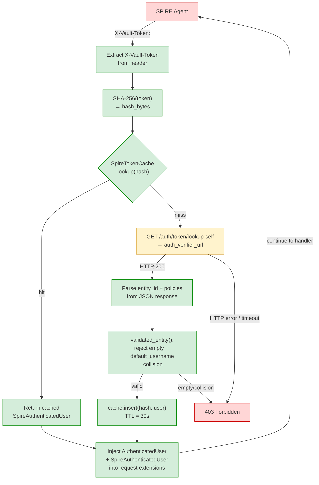
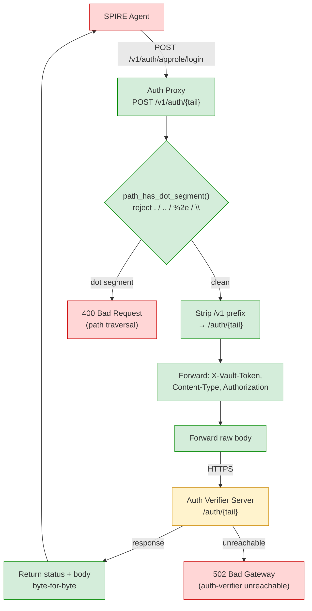
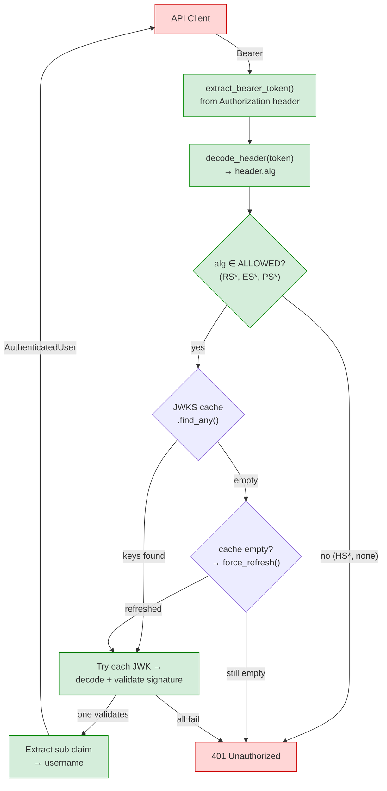

# Data Flow Diagram — KMS Authentication Subsystem (Spire Branch)

## Level 0 — Authentication System Context

```mermaid
flowchart LR
    classDef untrusted fill:#ffd6d6,stroke:#cc0000
    classDef semitrusted fill:#fff3cd,stroke:#cc8800
    classDef trusted fill:#d4edda,stroke:#008800
    classDef datastore fill:#cce5ff,stroke:#0066cc

    subgraph Internet["Internet (Untrusted)"]
        SPIREClient["SPIRE Agent\n(SPIFFE workload)"]:::untrusted
        Browser["Browser\n(UI user)"]:::untrusted
        CLI["ckms CLI\n(API token / JWT)"]:::untrusted
    end

    subgraph AuthBoundary["--- Auth Trust Boundary ---"]
        subgraph MiddlewareStack["Middleware Stack (LIFO)"]
            CorsMW["Cors MW"]:::trusted
            VaultMW["Vault Token MW\n(X-Vault-Token)"]:::semitrusted
            TLSMW["TLS Auth MW\n(mTLS cert)"]:::trusted
            JWTMW["JWT Auth MW\n(OIDC Bearer)"]:::semitrusted
            ApiTokenMW["API Token MW\n(Bearer)"]:::trusted
            SessionMW["Session Auth MW\n(cookie)"]:::trusted
            AuthVerifierMW["Auth Verifier MW\n(Cosmian JWT)"]:::semitrusted
            EnsureMW["Ensure Auth MW\n(fallback)"]:::trusted
        end
    end

    subgraph AuthVerifierZone["Auth Verifier (External)"]
        AuthVerifier["Auth Verifier Server\n(JWKS + lookup-self)"]:::semitrusted
    end

    KMIPHandler["KMIP / Transit / PKI\nHandlers"]:::trusted
    DB[("Database\n(SQLite/PostgreSQL)")]:::datastore

    SPIREClient -.->|"X-Vault-Token"| VaultMW
    Browser -.->|"session cookie\n_EA_"| SessionMW
    CLI -.->|"Bearer JWT/API token"| JWTMW
    CLI -.->|"Bearer Auth Verifier JWT"| AuthVerifierMW

    VaultMW ==|"GET /auth/token/lookup-self\n(HTTPS)"| AuthVerifier
    JWTMW ==|"GET /.well-known/jwks.json\n(HTTPS)"| AuthVerifier
    AuthVerifierMW ==|"GET /.well-known/jwks.json\n(HTTPS)"| AuthVerifier

    CorsMW --> VaultMW
    VaultMW --> TLSMW
    TLSMW --> JWTMW
    JWTMW --> ApiTokenMW
    ApiTokenMW --> SessionMW
    SessionMW --> AuthVerifierMW
    AuthVerifierMW --> EnsureMW
    EnsureMW -->|"AuthenticatedUser"| KMIPHandler
    KMIPHandler -->|"key blobs"| DB
```

## Level 1 — SPIRE Token Validation Flow



## Level 2 — Auth Proxy Flow (Unauthenticated)



## Level 3 — Auth Verifier JWT Validation Flow



## Notes

- **Auth Proxy is unauthenticated by design**: The `/v1/auth/*` scope has no auth middleware. This is intentional — SPIRE agents need to authenticate *through* the auth-verifier (AppRole login, token lookup). The path traversal protection (`path_has_dot_segment`) is the primary security control.
- **`accept_invalid_certs` is a dual-use flag**: Both the JWKS manager and the Vault HTTP client honor it. If enabled in production, it defeats TLS verification for auth-verifier connections.
- **`find_any()` key iteration**: Auth Verifier tokens lack `kid`, so every JWKS key is tried sequentially. This is O(n) in the number of keys but acceptable for typical JWKS sizes (1–5 keys).
- **Session cookie security**: Depends on actix-session's encrypted cookie backend with the `ui_session_salt`. The salt must be identical across load-balanced instances.
