# E2E Playwright Tests

End-to-end tests validating the UI → WASM → KMIP → KMS pipeline.

## FIPS mode

Run `bash .github/scripts/nix.sh --variant fips test ui` to execute the suite
against a FIPS-mode KMS server. Three spec files are automatically skipped in
FIPS mode because they exercise algorithms that are not NIST-approved:

| Skipped spec      | Reason                                            |
| ----------------- | ------------------------------------------------- |
| `covercrypt-flow` | Covercrypt is a non-FIPS algorithm                |
| `pqc-key-flow`    | ML-KEM, ML-DSA, SLH-DSA are non-FIPS              |
| `pqc-encaps-sign` | ML-KEM, ML-DSA, SLH-DSA, Hybrid KEMs are non-FIPS |

In addition, specific individual tests inside otherwise-FIPS-compatible spec files
are skipped because the underlying algorithm is not FIPS 140-3 approved:

| Spec                 | Test                                             | Reason                                       |
| -------------------- | ------------------------------------------------ | -------------------------------------------- |
| `ec-encrypt-sign`    | ECIES encrypt then decrypt preserves plaintext   | ECIES KDF is not FIPS-approved               |
| `ec-encrypt-sign`    | encrypt with wrong public key then decrypt fails | ECIES KDF is not FIPS-approved               |
| `rsa-export-options` | wrap sym key with RSA PKCS v1.5                  | RSA PKCS1v15 encryption is not FIPS-approved |

These skips are controlled by the `PLAYWRIGHT_FIPS_MODE=true` environment variable,
which `test_ui.sh` injects automatically when run with `--variant fips`.

All remaining specs (symmetric, RSA, EC/P-256 sign/verify, certificates, MAC, locate,
attributes, access-rights, cloud integrations, …) run unchanged in FIPS mode.

## Symmetric Keys

### sym-key-flow

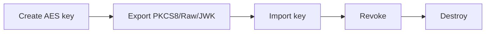

### symmetric-encrypt-decrypt

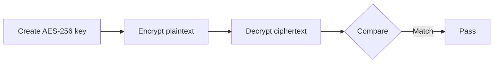

Covers AES-GCM 128/256, nonce sizes, and authenticated data.

## RSA Keys

### rsa-key-flow

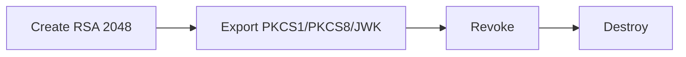

### rsa-encrypt-sign

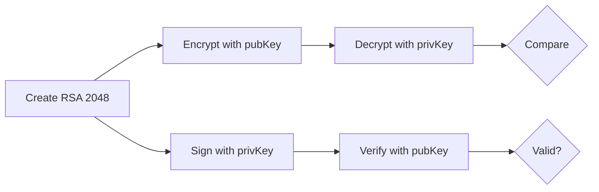

Covers OAEP-SHA256, CKM-RSA-PKCS, PKCS1v15-SHA256.

### rsa-import-options

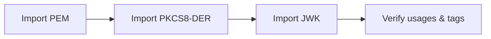

### rsa-export-options

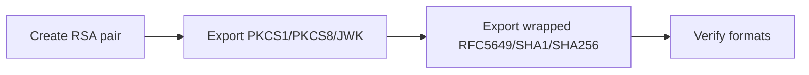

## Elliptic Curve Keys

### ec-key-flow

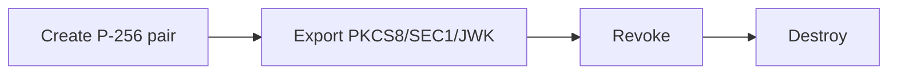

### ec-encrypt-sign

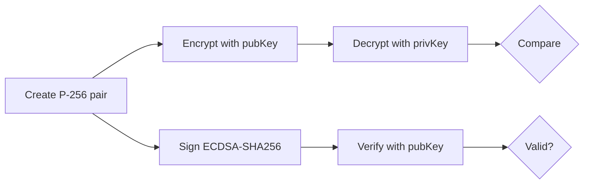

Covers ECIES encryption and ECDSA signing on NIST P-256.

## Certificates

### certificates-flow

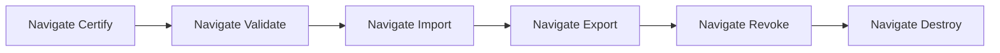

### cert-lifecycle

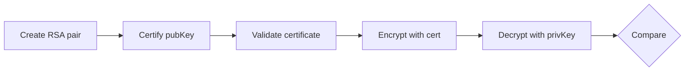

## Locate & Filters

### locate-flow

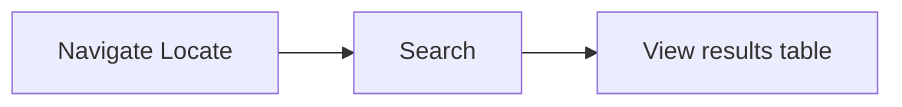

### locate-filters

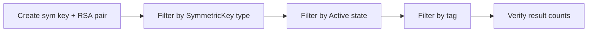

### locate-hsm

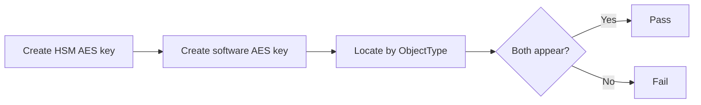

Validates that HSM keys (created with the `hsm::` prefix) appear alongside
software keys in Locate results. HSM keys always show `Active` state and no
`Unknown` state is present. The `PLAYWRIGHT_HSM_KEY_COUNT` HSM keys
pre-created by `test_ui.sh` are discovered through table pagination.
The inner `Locate – HSM keys (real SoftHSM2)` suite is skipped automatically
when `PLAYWRIGHT_HSM_KEY_COUNT` is 0 (SoftHSM2 not available).

## MAC

### mac-flow

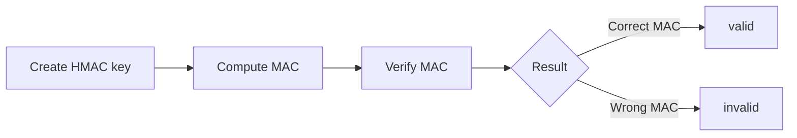

Covers HMAC-SHA256 and HMAC-SHA1 (issue #786). Tests include:

- Navigation smoke tests for the compute and verify pages
- HMAC-SHA256 compute returning `MAC (hex): <hex>`
- HMAC-SHA1 compute
- Error when key ID is missing
- Compute → verify roundtrip returning `valid` (SHA256 and SHA1)
- Wrong MAC → `invalid`

## CoverCrypt

_Skipped in FIPS mode._

### covercrypt-flow

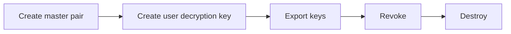

## Post-Quantum Cryptography (PQC)

_Skipped in FIPS mode._

### pqc-key-flow

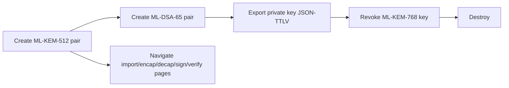

Covers ML-KEM-512, ML-KEM-768 and ML-DSA-65 key-pair creation, export, revoke,
destroy, and navigation to all PQC operation pages.

### pqc-encaps-sign

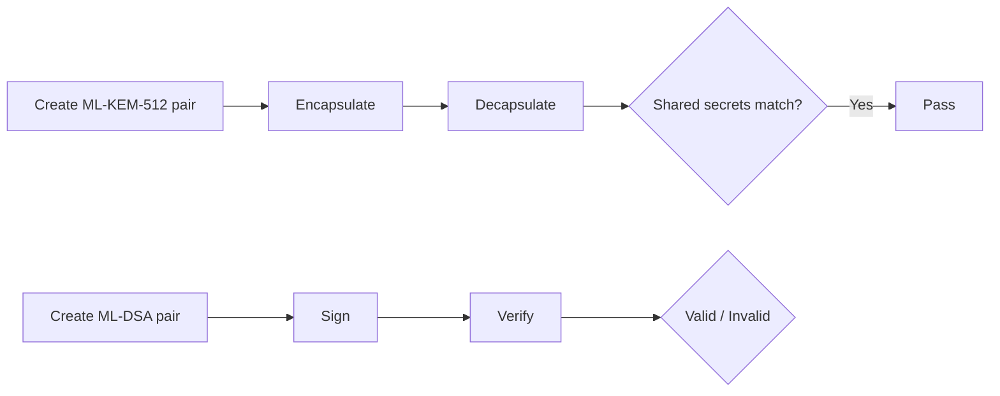

Covers:

- ML-KEM-512 encapsulate → decapsulate roundtrip
- Encapsulate without key ID → error
- ML-DSA-44/65/87 sign → verify (correct key → `Valid`; wrong key → `invalid`; tampered data → `invalid`)
- Hybrid KEM X25519MLKEM768 encapsulate → decapsulate
- SLH-DSA-SHA2-128s sign → verify (signatures > 1 000 bytes)
- Configurable hybrid KEMs (ML-KEM-512-P256, ML-KEM-768-P256, ML-KEM-512-Curve25519, ML-KEM-768-Curve25519) key creation with mocked `branding.json`

## Cloud Integrations

### google-cmek-wrap-flow


### google-cse-flow

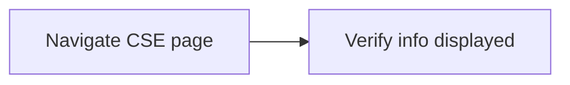

### azure-flow

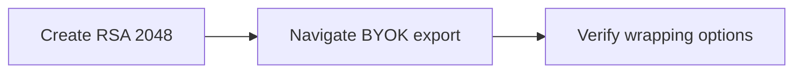

### aws-flow

Navigation / smoke tests for AWS BYOK pages. Functional tests require external
AWS KEK files and are therefore kept as navigation-only checks.

```mermaid
graph LR
    A[Navigate AWS import-kek] --> B[Verify page renders]
    C[Navigate AWS export-key-material] --> D[Verify page renders]
```

## Derive Key

### derive-key-flow

```mermaid
graph LR
    A[Create AES-256 key with DeriveKey mask] --> B[Navigate /derive-key]
    B --> C[PBKDF2 derive → check UUID in response]
    A --> D[PBKDF2 with custom output key ID]
    A --> E[HKDF derive → check UUID in response]
```

Tests create the base key directly via the KMIP API (with `CryptographicUsageMask:
DeriveKey = 0x200`) because the standard key-creation UI form does not expose
that mask. All three derivation paths (basic PBKDF2, PBKDF2 with custom output ID,
and HKDF) are exercised.

## Other Flows

### opaque-flow

```mermaid
graph LR
    A[Create opaque object] --> B[Export]
    B --> C[Import]
    C --> D[Revoke]
    D --> E[Destroy]
```

### secret-data-flow

```mermaid
graph LR
    A[Create secret data] --> B[Export]
    B --> C[Import]
    C --> D[Revoke]
    D --> E[Destroy]
```

### access-rights-flow

```mermaid
graph LR
    A[Create key] --> B[Grant access]
    B --> C[List access rights]
    C --> D[Revoke access]
```

### attributes-flow

```mermaid
graph LR
    A[Create key] --> B[Get attributes]
    B --> C[Set attribute]
    C --> D[Modify attribute]
    D --> E[Delete attribute]
```

Covers:

- Navigation to get/set/modify/delete attribute pages
- `child_id` link: set+delete; set+modify
- Name attribute (KMIP standard, issue #746): set; set → get (not hex); set → modify → delete
- `cryptographic_length`: set → get → modify
- `key_usage`: set → delete
- `cryptographic_algorithm`: set
- Multiple link attributes on one key
- Non-existent object ID returns response (no crash)

### vendor-id-flow

```mermaid
graph LR
    A[Query server info] --> B[Extract vendor ID]
    B --> C[Verify KMIP requests use vendor ID]
```

### sitemap

```mermaid
graph LR
    A[For each route] --> B[Navigate]
    B --> C[Verify page loads]
```
