# E2E Playwright Tests

End-to-end tests validating the UI → WASM → KMIP → KMS pipeline.

## Symmetric Keys

### sym-key-flow

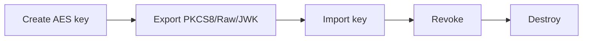

### symmetric-encrypt-decrypt

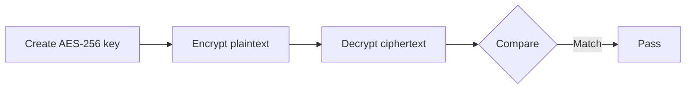

Covers AES-GCM 128/256, nonce sizes, and authenticated data.

## RSA Keys

### rsa-key-flow

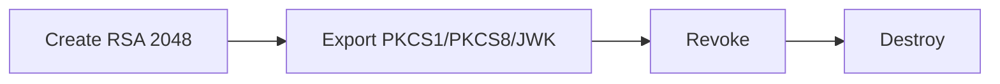

### rsa-encrypt-sign

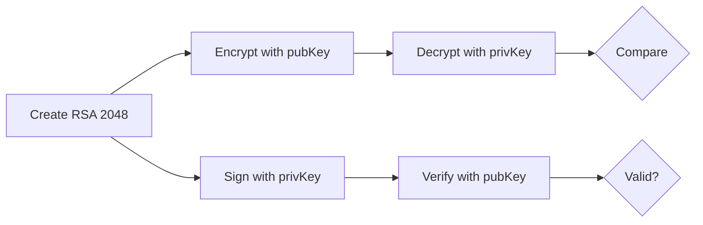

Covers OAEP-SHA256, CKM-RSA-PKCS, PKCS1v15-SHA256.

### rsa-import-options

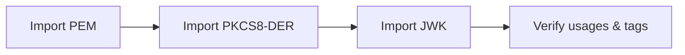

### rsa-export-options

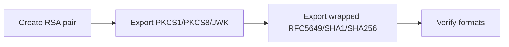

## Elliptic Curve Keys

### ec-key-flow

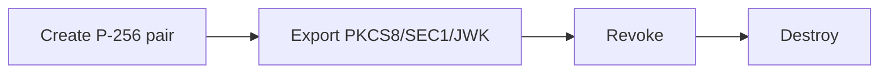

### ec-encrypt-sign

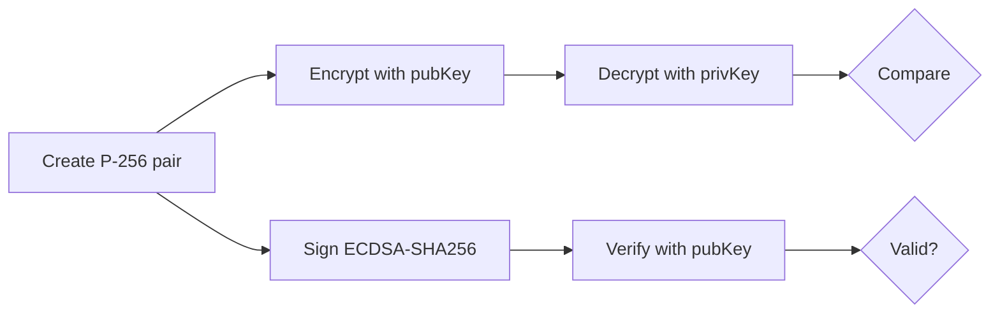

Covers ECIES encryption and ECDSA signing on P-256/P-384/P-521 and Ed25519.

## Certificates

### certificates-flow

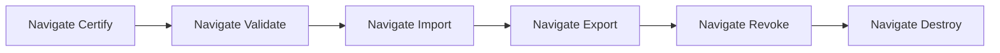

### cert-lifecycle

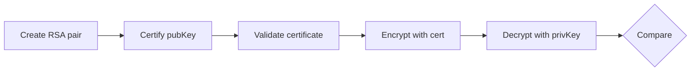

## Locate & Filters

### locate-flow

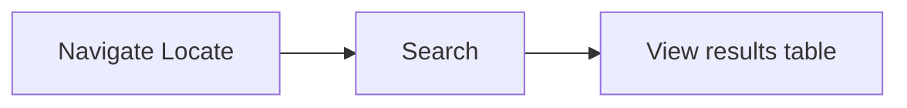

### locate-filters

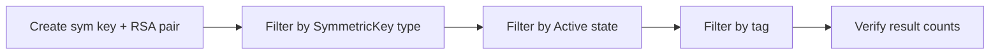

## CoverCrypt

### covercrypt-flow

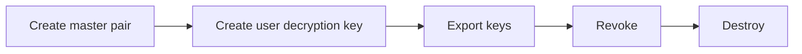

## Cloud Integrations

### google-cmek-wrap-flow


### google-cse-flow

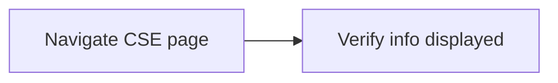

### azure-flow

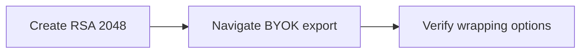

## Other Flows

### opaque-flow

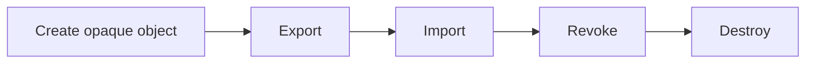

### secret-data-flow

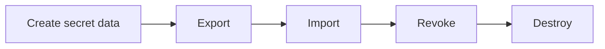

### access-rights-flow

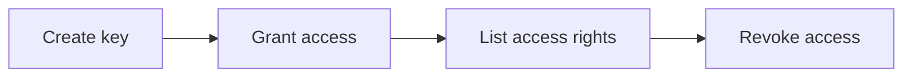

### attributes-flow

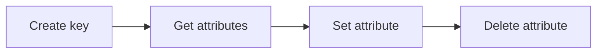

### vendor-id-flow

```mermaid
graph LR
    A[Query server info] --> B[Extract vendor ID]
    B --> C[Verify KMIP requests use vendor ID]
```

### sitemap

```mermaid
graph LR
    A[For each route] --> B[Navigate]
    B --> C[Verify page loads]
```
